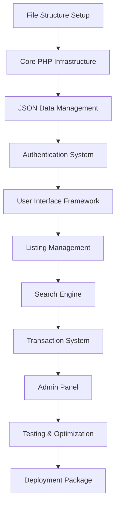
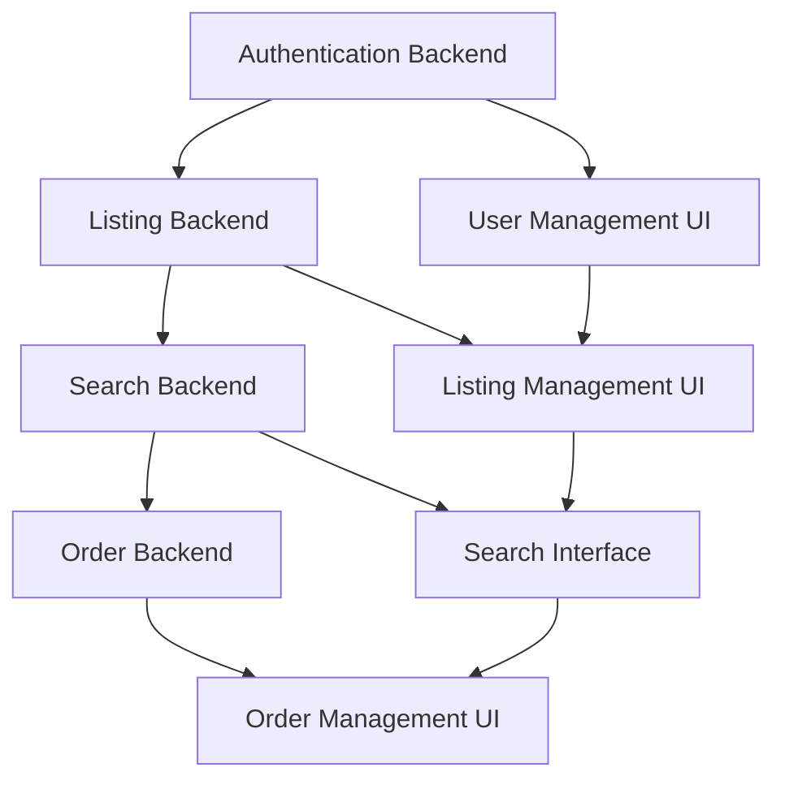

First, brainstorming

We are planning to develop an application where a user can capture images for a product or service, add name, description, number of units (if applicable for this service or product, and if it is activated the client can show the number of units left) and cost per unit, hour, day, other., he can also add tags to that. There is also a button that detect the user's location (he can manually change the Lat and long if he needs to as well, then he posts that. Another option there is opening the ability to book a time to get the service (the customer can book a time from available slots). The supplier can decide if the product purchase requires sales approval or not. If it does, the sales will be formal once the supplier approves the customer request to buy. If sales approval is not requires then the sales takes place once the customer buys it. The payment is made on purchase date. It is locked in the system account till the delivery time due. If both the buyer and the seller confirms the sales as complete, the money moves to the seller account. If not, and any of the two parties requests moving the money to his account, the other has to approve it, and if that doesn't happen, the one blocking the completion of the transfer can start a dispute in 72 hours and each side present his case for the system admins to judge on the transfer. If the one blocking the transfer does not present his case Another user browsing the products and services in the system, can filter how close the distance he wants to filter accordingly (the radius), price min and max, multi tags... Then if he finds what he wants, he can go thru the purchase operation.

Second, a primary PRD draft:

1. Executive Summary
A location-based marketplace platform that enables users to buy and sell products or services nearby, with secure escrow payments, optional booking features, and built-in dispute resolution. The platform emphasizes trust, transparency, and convenience, while supporting sellers with tools to manage inventory, availability, and payments.
2. Goals & Success Metrics
·	Goals:
o	Build a trusted platform for local commerce.
o	Provide secure transactions via escrow.
o	Support both products (units) and services (bookings).
o	Minimize disputes with structured approval & resolution flows.
o	Scale revenue through commissions, subscriptions, and premium features.
·	Success Criteria:
o	User Adoption: 1,000+ active users within 6 months.
o	Transaction Success Rate: >95% completed without disputes.
o	User Satisfaction: Avg. rating >4.0/5.0.
o	Financial Health: Positive unit economics by month 12.
3. User Roles
3.1 Supplier (Seller/Service Provider)
·	Create/manage listings.
·	Define availability & pricing.
·	Approve/reject purchase requests (if enabled).
·	Confirm delivery/service completion.
·	Access financial reports.
3.2 Customer (Buyer)
·	Register & maintain profile.
·	Browse, search, and filter listings.
·	Purchase or book services.
·	Rate/review completed transactions.
·	Track order history.
3.3 System Administrator
·	Manage users & roles.
·	Oversee disputes.
·	Monitor transactions.
·	Enforce compliance policies.
4. Core Features
4.1 User Management & Authentication
·	Registration/login (email, phone, OAuth).
·	Profile management with ratings & reviews.
·	Seller verification (ID, documents).
·	User roles: Customer, Supplier, Admin.
4.2 Listings Management (Supplier)
·	Upload up to 10 images (min 1, quality checks). Or capture directly using the device builtin camera.
·	Add title, description (500-char limit).
·	Pricing options: per unit / hour / day / project.
·	Set stock (optional), toggle “show stock left.”
·	Add tags (max 10).
·	Assign category (predefined taxonomy).
·	Location: auto-detect GPS + manual override.
·	Availability calendar (for services, with recurring slots).
·	Enable/disable sales approval toggle.
·	Set listing status (active, paused, archived).
4.3 Discovery & Search (Customer)
·	Filters:
o	Radius (1–50 km).
o	Price min/max.
o	Multi-tag selection.
o	Category filtering.
o	Availability filter.
o	Rating filter.
·	Search & Browse:
o	Keyword search.
o	Category browsing.
o	Sorting: distance, price, rating, date posted.
o	Map view with markers.
·	User Experience Enhancements:
o	Favorites / saved searches.
o	Recently viewed items.
4.4 Purchase & Booking Flow
Standard Purchase (No Approval Required)
1.	Customer selects item/service.
2.	Enters quantity/time slot.
3.	Reviews total cost.
4.	Pays (funds held in escrow).
5.	Seller notified → fulfills order.
Approval-Required Purchase
1.	Customer submits purchase request.
2.	Seller approves/rejects.
3.	If approved → Customer pays → Escrow.
4.	Transaction proceeds to fulfillment.
Booking System (Services)
·	View available slots in calendar.
·	Select date/time.
·	Add notes/special requests.
·	Receive confirmation + reminders.
·	Support for recurring availability.
4.5 Payments & Escrow
·	Payment gateway integration (Stripe, PayPal, or similar).
·	Multi-payment methods (credit, debit, wallets).
·	Platform fee deducted per transaction.
·	Escrow holding until completion.
Release Logic:
1.	Both confirm → funds released.
2.	One requests release → other has 72h to approve/dispute.
3.	No dispute → auto-release.
4.	Dispute → Admin resolves.
Additional:
·	Refund policies (partial/full based on supplier settings).
·	Multi-currency support (future phase).
·	Tax calculation compliance (country-specific).
4.6 Communication System
·	In-app chat (buyer ↔ supplier).
·	Order-specific threads (auditable for disputes).
·	File upload (images/documents).
·	Push + email notifications.
4.7 Ratings & Reviews
·	Buyers rate suppliers post-completion.
·	Text review + star rating.
·	Ratings aggregated to supplier profile.
4.8 Admin Tools
·	Dispute dashboard with evidence logs.
·	Fraud detection & flagged activity alerts.
·	User suspension/banning.
·	Financial reporting & transaction logs.
5. Technical & Security Requirements
·	Mobile-first: iOS/Android native apps.
·	Web portal for sellers/admins.
·	Cloud storage for media.
·	Data Security:
o	PCI DSS compliance.
o	Encrypted storage & transport.
o	GDPR/data privacy compliance.
·	Scalability: Microservices architecture with cloud deployment.
·	Performance: Search <2s, Payment <3s processing.
6. Business Model
·	Revenue Streams:
o	Transaction fees (2–5%).
o	Featured listings.
o	Premium seller subscriptions.
o	Payment processing margins.
·	Metrics to Track:
o	GMV (Gross Merchandise Value).
o	Active users.
o	Conversion rates.
o	Dispute frequency.
o	Retention rates.
7. Roadmap (Phased Implementation)
Phase 1 (MVP)
·	User registration/authentication.
·	Basic listing creation & browsing.
·	Simple filtering.
·	Purchase flow + escrow.
·	In-app messaging.
Phase 2
·	Full booking system.
·	Advanced search & filters.
·	Ratings & reviews.
·	Mobile apps.
·	Dispute evidence system.
Phase 3
·	Analytics dashboards for sellers.
·	AI-driven recommendations.
·	Multi-currency & tax support.
·	Loyalty & referral programs.
·	API for integrations.
8. Risk Mitigation
·	Fraud & scams → ID verification, reviews, escrow, admin monitoring.
·	Payment disputes → Clear policy + automated escrow workflows.
·	Low adoption → Incentives, referral bonuses, early adopter campaigns.
·	Legal compliance → Ongoing legal reviews, prohibited items list, terms & privacy.
·	Technical downtime → Redundant infrastructure, monitoring, SLAs.
9. Final notes
1.	Cancellation/refund policy: The seller decides the cancelation conditions (for example: 1)once purchased, cant cancel. Or 2) Cancelation allowed # of hours before delivery time or after purchase confirmed. or 3) cancelation allowed anytime before sales completion. And the client can see that condition in the product description - the system reacts to cancelation request accordingly).
2.	Payment providers – Stripe/PayPal or other integrations via api
4.	Commission model – fixed fee, % fee, or hybrid, the system admin sets the rates from the backend.
5.	Booking: we need support for recurring services (weekly/monthly)


# LocalMarket Prototype - Workspace Summary & Context Map

## 📋 Project Overview

**Project Name:** LocalMarket Prototype  
**Objective:** Create a fully functional marketplace prototype demonstrating core features with simple deployment  
**Technology Stack:** HTML5, CSS3, JavaScript, PHP, JSON file storage  
**Deployment Method:** Single ZIP file extraction to Plesk subdirectory  

## 🎯 Core Mission
Build a location-based marketplace prototype that validates the business concept while maintaining simplicity for easy demonstration and stakeholder presentation.

## 📚 Documentation Library

### 1. **Product Requirements Document (PRD)**
- **File:** `prototype_prd.md`
- **Purpose:** Complete feature specifications and acceptance criteria
- **Key Sections:** 
  - User roles and flows
  - Technical requirements
  - Security considerations
  - Success metrics

### 2. **Development Architecture Guide**
- **File:** `development_architecture.md`
- **Purpose:** Technical blueprint and implementation patterns
- **Key Sections:**
  - System architecture overview
  - Component specifications
  - Code organization principles
  - Performance optimization strategies

### 3. **Implementation Roadmap**
- **File:** `implementation_roadmap.md`
- **Purpose:** Project management and development timeline
- **Key Sections:**
  - Phase-by-phase development plan
  - Team structure and responsibilities
  - Quality assurance strategy
  - Risk mitigation plans

### 4. **Master Execution Plan**
- **File:** `master_execution_plan.md`
- **Purpose:** Strategic overview and dependency mapping
- **Key Sections:**
  - Dependency chain analysis
  - Component interconnection map
  - Technical implementation deep dive
  - Success validation framework

## 🔄 Development Process Flow

### Phase 1: Foundation (Days 1-7)
```
Infrastructure Setup → Authentication System → UI Framework → Integration Testing
```

### Phase 2: Listing Management (Days 8-14)
```
Backend API → Image Handling → Management UI → Advanced Features
```

### Phase 3: Search & Discovery (Days 15-21)
```
Search Backend → Interface Development → Filter Implementation → Optimization
```

### Phase 4: Transaction System (Days 22-28)
```
Order Processing → Booking System → Management UI → Flow Optimization
```

### Phase 5: Admin Panel (Days 29-35)
```
Admin Structure → User Management → Analytics → Configuration
```

### Phase 6: Testing & Deployment (Days 36-42)
```
Comprehensive Testing → UI Polish → Bug Fixes → Package Preparation
```

## 🏗️ System Architecture Map

### Component Hierarchy
```
Presentation Layer (HTML/CSS/JS)
    ↓
API Gateway Layer (PHP endpoints)
    ↓
Data Access Layer (JSON operations)
    ↓
Storage Layer (JSON files)
```

### Core Features Matrix
| Feature | Backend Component | Frontend Component | Dependencies |
|---------|-------------------|-------------------|--------------|
| **Authentication** | `auth.php` | `auth.js` | Session management |
| **Listings** | `listings.php` | `listingManager.js` | Authentication, Image upload |
| **Search** | `search.php` | `searchEngine.js` | Location services, Filtering |
| **Orders** | `orders.php` | `orderManager.js` | Authentication, Listings |
| **Admin** | `admin.php` | `adminPanel.js` | Authentication, All data |

## 🎛️ Configuration & Settings

### Demo Accounts
- **Admin 1:** `admin1` (full system access)
- **Admin 2:** `admin2` (full system access)
- **Users:** Self-registration with unique usernames

### Technical Specifications
- **Browser Support:** Chrome 90+, Firefox 88+, Safari 14+, Edge 90+
- **Performance Targets:** Page load <3s, Search <2s, Upload <30s
- **Security:** Input validation, file upload restrictions, session management
- **Mobile Support:** Responsive design, camera integration, GPS services

## 🔧 Key Implementation Patterns

### JavaScript Architecture
```javascript
// Module Pattern for feature isolation
const FeatureManager = (function() {
    // Private implementation
    return {
        // Public API
    };
})();

// State Management for UI consistency
const AppState = {
    getState(), setState(), subscribe()
};
```

### PHP Architecture
```php
// Repository Pattern for data access
class DataRepository {
    public function create($data) { /* JSON operations */ }
    public function find($criteria) { /* Search logic */ }
}

// Service Layer for business logic
class BusinessService {
    public function processOperation($data) { /* Validation + Repository */ }
}
```

## 📊 Success Metrics Dashboard

### Technical Metrics
- ✅ All user flows complete successfully
- ✅ Performance targets met
- ✅ Cross-browser compatibility achieved
- ✅ Mobile responsiveness verified
- ✅ Security standards implemented

### Business Metrics
- ✅ Core marketplace functionality demonstrated
- ✅ User experience validated
- ✅ Scalability foundation established
- ✅ Stakeholder requirements satisfied
- ✅ Technical feasibility proven

## 🚀 Next Steps Protocol

### Upon Completion of This Planning Phase:
1. **Begin Phase 1 Development** - Infrastructure setup
2. **Establish Development Environment** - Tools and workflows
3. **Initialize Version Control** - Branch structure and commit standards
4. **Create Base File Structure** - Directory layout and initial files
5. **Start Daily Progress Tracking** - Milestone monitoring

### Development Readiness Checklist:
- [ ] All planning documents reviewed and approved
- [ ] Technical architecture understood and validated
- [ ] Development timeline confirmed
- [ ] Resource allocation verified
- [ ] Risk mitigation strategies in place
- [ ] Success criteria clearly defined

## 📝 Development Notes & Reminders

### Critical Implementation Points:
1. **JSON File Locking:** Implement proper file locking for concurrent access
2. **Image Optimization:** Compress images client-side before upload
3. **Location Accuracy:** Provide manual override for GPS detection
4. **Error Handling:** Comprehensive error messages and recovery options
5. **Mobile Camera:** Test camera capture across different devices
6. **Search Performance:** Index frequently searched fields
7. **Security Validation:** Sanitize all user inputs
8. **Session Management:** Secure session handling with proper timeouts

### Quality Assurance Focus:
- **Cross-browser testing** on all target browsers
- **Mobile device testing** across different screen sizes
- **Performance testing** under simulated load
- **Security testing** for common vulnerabilities
- **User experience testing** for intuitive navigation
- **Data integrity testing** for JSON file operations


# LocalMarket Prototype - Master Execution Plan & Dependency Map

## 1. Executive Context & Strategic Overview

### 1.1 Mission Statement
Create a fully functional, demonstrable marketplace prototype that validates the core business concept while maintaining simplicity for easy deployment and stakeholder presentation.

### 1.2 Critical Success Factors
1. **Technical Feasibility:** Prove the system can be built with current technology
2. **User Experience Validation:** Demonstrate intuitive, valuable user interactions
3. **Business Model Validation:** Show how the platform creates value for all parties
4. **Deployment Simplicity:** Enable easy installation and demonstration
5. **Scalability Foundation:** Establish architecture that can grow into full system

### 1.3 Stakeholder Value Proposition
- **Investors:** Tangible proof of concept with clear ROI potential
- **Technical Team:** Validated architecture and implementation approach
- **Business Team:** User experience validation and market fit assessment
- **End Users:** Early preview of platform capabilities and benefits

## 2. Strategic Development Architecture

### 2.1 Pyramid Architecture Model
```
                    [COMPLETE SYSTEM DEMO]
                           /           \
                [USER FLOWS]         [ADMIN FUNCTIONS]
                /         \              /          \
        [LISTINGS]    [TRANSACTIONS]  [MANAGEMENT]  [ANALYTICS]
         /     \        /        \        /     \      /      \
    [CREATE] [SEARCH] [BUY] [BOOKING] [USERS] [MODERATE] [REPORTS] [CONFIG]
     |       |       |       |        |       |         |        |
   [CORE INFRASTRUCTURE: AUTH, DATA, API, UI FRAMEWORK]
                                |
                    [FOUNDATION: PHP, JSON, HTML/CSS/JS]
```

### 2.2 Dependency Chain Analysis

#### Critical Path Dependencies


#### Parallel Development Opportunities


### 2.3 Component Interconnection Map

#### Core System Components
```
┌─────────────────────────────────────────────────────────────┐
│                    PRESENTATION LAYER                       │
├─────────────────────────────────────────────────────────────┤
│  Landing │ Auth │ Dashboard │ Listings │ Search │ Orders │ Admin │
│   Page   │ UI   │    UI     │    UI    │   UI   │   UI   │  Panel │
└─────┬─────────┬──────────┬──────────┬────────┬────────┬───────┘
      │         │          │          │        │        │
┌─────▼─────────▼──────────▼──────────▼────────▼────────▼───────┐
│                     API GATEWAY LAYER                        │
├─────────────────────────────────────────────────────────────┤
│  Auth  │ Listings │ Search │ Upload │ Orders │ Admin │ Utils │
│   API  │   API    │  API   │  API   │  API   │  API  │  API  │
└─────┬─────────┬─────────┬─────────┬────────┬────────┬───────┘
      │         │         │         │        │        │
┌─────▼─────────▼─────────▼─────────▼────────▼────────▼───────┐
│                   DATA ACCESS LAYER                         │
├─────────────────────────────────────────────────────────────┤
│ User  │ Listing │ Order │ Upload │ Config │ Session│ Logger │
│ Data  │  Data   │ Data  │  Data  │  Data  │  Data  │  Data  │
└─────┬─────────┬─────────┬─────────┬────────┬────────┬───────┘
      │         │         │         │        │        │
┌─────▼─────────▼─────────▼─────────▼────────▼────────▼───────┐
│                    STORAGE LAYER                            │
├─────────────────────────────────────────────────────────────┤
│ users.json │ listings.json │ orders.json │ config.json │ logs │
└─────────────────────────────────────────────────────────────┘
```

## 3. Implementation Execution Matrix

### 3.1 Phase-by-Phase Execution Plan

#### Phase 1: Foundation (Days 1-7)
**Core Objective:** Establish robust technical foundation

**Critical Components:**
```
Day 1-2: Infrastructure Setup
├── File structure creation
├── Basic PHP routing system
├── JSON data handling classes
├── Error logging system
└── Development environment configuration

Day 3-4: Authentication System
├── User registration logic
├── Login/logout functionality
├── Session management
├── Role-based access control
└── Security validation

Day 5-6: UI Framework
├── Responsive CSS grid system
├── Component library creation
├── JavaScript module system
├── Mobile-first design patterns
└── Cross-browser compatibility

Day 7: Integration & Testing
├── End-to-end authentication flow
├── Basic navigation system
├── Error handling validation
├── Performance baseline establishment
└── Documentation updates
```

**Success Validation:**
- [ ] Users can register and login successfully
- [ ] Session persists correctly across pages
- [ ] Admin access works with role verification
- [ ] UI is responsive across devices
- [ ] All core APIs respond correctly

#### Phase 2: Listing Management (Days 8-14)
**Core Objective:** Complete product/service creation and management

**Critical Components:**
```
Day 8-9: Listing Creation Backend
├── Listing data model implementation
├── Category and tag system
├── Validation logic for all listing fields
├── Data persistence and retrieval
└── API endpoint creation

Day 10-11: Image Handling System
├── File upload infrastructure
├── HTML5 camera capture integration
├── Image compression and optimization
├── Security validation for uploads
└── File storage management

Day 12-13: Listing Management UI
├── Intuitive listing creation form
├── Image upload interface with preview
├── Location detection and manual override
├── Category selection and tag input
└── Listing edit and delete functionality

Day 14: Advanced Features
├── Listing status management (active/paused)
├── Bulk operations for sellers
├── Listing analytics (views, interest)
├── Performance optimization
└── Mobile camera integration testing
```

**Success Validation:**
- [ ] Sellers can create complete listings with all fields
- [ ] Image upload works on desktop and mobile
- [ ] Camera capture functions across browsers
- [ ] Location detection is accurate and editable
- [ ] Listings are immediately searchable

#### Phase 3: Search & Discovery (Days 15-21)
**Core Objective:** Implement comprehensive search and filtering system

**Critical Components:**
```
Day 15-16: Search Backend Infrastructure
├── Location-based distance calculation
├── Multi-criteria filtering logic
├── Search indexing for performance
├── Results ranking algorithm
└── Pagination and sorting systems

Day 17-18: Search Interface Development
├── Advanced filter interface design
├── Real-time search results updates
├── Map integration with listing markers
├── Search history and saved searches
└── Mobile-optimized search experience

Day 19-20: Filter Implementation
├── Price range filtering
├── Distance radius selection
├── Category and tag filtering
├── Availability filtering for services
└── Combined filter logic optimization

Day 21: Search Optimization
├── Performance tuning for large datasets
├── Search result caching
├── User experience enhancements
├── Error handling for edge cases
└── Analytics tracking for searches
```

**Success Validation:**
- [ ] Search returns relevant results within 2 seconds
- [ ] Location filtering works accurately within specified radius
- [ ] Multiple filters work together correctly
- [ ] Map displays all listings with accurate positions
- [ ] Search interface is intuitive and responsive

#### Phase 4: Transaction System (Days 22-28)
**Core Objective:** Complete buying/selling transaction workflow

**Critical Components:**
```
Day 22-23: Order Processing Backend
├── Order creation and validation logic
├── Inventory management for products
├── Booking system for services
├── Order status tracking
└── Simple payment simulation

Day 24-25: Booking System Implementation
├── Calendar interface for service availability
├── Time slot selection and confirmation
├── Recurring booking options
├── Booking conflict resolution
└── Notification system for bookings

Day 26-27: Order Management UI
├── Checkout process design
├── Order confirmation and tracking
├── Buyer and seller dashboards
├── Order history and details
└── Order communication system

Day 28: Transaction Flow Optimization
├── End-to-end transaction testing
├── Error handling for edge cases
├── Performance optimization
├── User experience refinements
└── Mobile transaction testing
```

**Success Validation:**
- [ ] Users can complete purchases successfully
- [ ] Service booking works with calendar integration
- [ ] Order status updates correctly for all parties
- [ ] Transaction history is accurate and accessible
- [ ] Mobile checkout process is smooth

#### Phase 5: Admin Panel (Days 29-35)
**Core Objective:** Implement comprehensive administrative controls

**Critical Components:**
```
Day 29-30: Admin Authentication & Structure
├── Admin role verification system
├── Admin panel navigation design
├── Dashboard overview implementation
├── Security access controls
└── Admin activity logging

Day 31-32: User & Listing Management
├── User account management interface
├── Listing moderation tools
├── Content approval workflow
├── Suspension and banning system
└── Bulk management operations

Day 33-34: Analytics & Reporting
├── User registration metrics
├── Listing creation statistics
├── Transaction volume tracking
├── Search behavior analysis
└── Revenue simulation reporting

Day 35: System Configuration
├── Platform settings management
├── Category and tag administration
├── System maintenance tools
├── Data export functionality
└── Backup and restore procedures
```

**Success Validation:**
- [ ] Admins can manage all users and listings
- [ ] Moderation tools function correctly
- [ ] Analytics display accurate real-time data
- [ ] System configuration changes apply correctly
- [ ] Admin logs track all administrative actions

#### Phase 6: Testing & Deployment (Days 36-42)
**Core Objective:** Comprehensive testing and deployment preparation

**Critical Components:**
```
Day 36-37: Comprehensive Testing
├── Cross-browser compatibility testing
├── Mobile device testing across platforms
├── User flow testing end-to-end
├── Performance testing under load
└── Security vulnerability assessment

Day 38-39: UI/UX Polish & Optimization
├── Visual design consistency review
├── User experience flow optimization
├── Accessibility compliance verification
├── Performance optimization implementation
└── Error message and feedback improvements

Day 40-41: System Integration & Bug Fixes
├── Complete system integration testing
├── Bug identification and resolution
├── Data integrity verification
├── API endpoint stability testing
└── Documentation accuracy verification

Day 42: Deployment Package Preparation
├── Final code review and cleanup
├── Deployment package creation
├── Installation documentation completion
├── Demo data preparation
└── Go-live readiness verification
```

**Success Validation:**
- [ ] All user flows work flawlessly across devices
- [ ] Performance meets or exceeds targets
- [ ] Security assessment passes
- [ ] Documentation is complete and accurate
- [ ] Deployment package installs successfully

## 4. Technical Implementation Deep Dive

### 4.1 Critical Code Implementation Strategies

#### Database Layer (JSON Management)
```php
<?php
class DataManager {
    private $dataPath;
    private $lockFile;
    
    public function __construct($dataPath) {
        $this->dataPath = $dataPath;
        $this->lockFile = $dataPath . '.lock';
    }
    
    /**
     * Thread-safe data operations with file locking
     */
    public function writeData($filename, $data) {
        $lockHandle = fopen($this->lockFile, 'w');
        
        if (flock($lockHandle, LOCK_EX)) {
            try {
                $jsonData = json_encode($data, JSON_PRETTY_PRINT);
                if ($jsonData === false) {
                    throw new Exception('JSON encoding failed: ' . json_last_error_msg());
                }
                
                $result = file_put_contents($this->dataPath . '/' . $filename, $jsonData);
                if ($result === false) {
                    throw new Exception('Failed to write data file');
                }
                
                return true;
            } finally {
                flock($lockHandle, LOCK_UN);
                fclose($lockHandle);
            }
        } else {
            throw new Exception('Could not acquire file lock');
        }
    }
    
    /**
     * Optimized data reading with caching
     */
    private $cache = [];
    
    public function readData($filename, $useCache = true) {
        if ($useCache && isset($this->cache[$filename])) {
            return $this->cache[$filename];
        }
        
        $filepath = $this->dataPath . '/' . $filename;
        
        if (!file_exists($filepath)) {
            return ['data' => [], 'metadata' => ['version' => '1.0', 'lastUpdated' => date('c')]];
        }
        
        $jsonData = file_get_contents($filepath);
        $data = json_decode($jsonData, true);
        
        if ($data === null) {
            throw new Exception('JSON parsing failed: ' . json_last_error_msg());
        }
        
        if ($useCache) {
            $this->cache[$filename] = $data;
        }
        
        return $data;
    }
}
?>
```

#### Frontend State Management
```javascript
// Centralized application state management
const AppState = (function() {
    let state = {
        user: null,
        listings: [],
        searchFilters: {},
        currentView: 'home',
        loading: false,
        errors: []
    };
    
    const listeners = {};
    
    return {
        // Get current state
        getState() {
            return { ...state };
        },
        
        // Update state and notify listeners
        setState(updates) {
            const prevState = { ...state };
            state = { ...state, ...updates };
            
            // Notify listeners of state changes
            Object.keys(updates).forEach(key => {
                if (listeners[key]) {
                    listeners[key].forEach(callback => {
                        callback(state[key], prevState[key]);
                    });
                }
            });
        },
        
        // Subscribe to state changes
        subscribe(key, callback) {
            if (!listeners[key]) {
                listeners[key] = [];
            }
            listeners[key].push(callback);
            
            // Return unsubscribe function
            return () => {
                const index = listeners[key].indexOf(callback);
                if (index > -1) {
                    listeners[key].splice(index, 1);
                }
            };
        }
    };
})();

// Example usage in search component
const SearchComponent = {
    init() {
        // Subscribe to search filter changes
        AppState.subscribe('searchFilters', (newFilters) => {
            this.updateSearchResults(newFilters);
        });
        
        // Subscribe to user location changes
        AppState.subscribe('user', (newUser) => {
            if (newUser && newUser.location) {
                this.updateLocationBasedSearch(newUser.location);
            }
        });
    },
    
    updateSearchResults(filters) {
        AppState.setState({ loading: true });
        
        SearchAPI.search(filters)
            .then(results => {
                AppState.setState({ 
                    listings: results,
                    loading: false 
                });
            })
            .catch(error => {
                AppState.setState({ 
                    errors: [...AppState.getState().errors, error],
                    loading: false 
                });
            });
    }
};
```

### 4.2 Performance Optimization Implementation

#### Search Performance Optimization
```php
<?php
class OptimizedSearchEngine {
    private $indexPath = '/data/search_index.json';
    private $spatialIndex = [];
    
    /**
     * Build spatial index for location-based searches
     */
    public function buildSpatialIndex($listings) {
        $index = [];
        
        foreach ($listings as $listing) {
            // Create grid-based spatial index
            $gridSize = 0.01; // ~1km grid
            $gridX = floor($listing['location']['lat'] / $gridSize);
            $gridY = floor($listing['location']['lng'] / $gridSize);
            $gridKey = "{$gridX}_{$gridY}";
            
            if (!isset($index[$gridKey])) {
                $index[$gridKey] = [];
            }
            
            $index[$gridKey][] = $listing['id'];
        }
        
        $this->spatialIndex = $index;
        file_put_contents($this->indexPath, json_encode($index));
    }
    
    /**
     * Fast location-based search using spatial index
     */
    public function searchByLocation($lat, $lng, $radius) {
        if (empty($this->spatialIndex)) {
            $this->spatialIndex = json_decode(file_get_contents($this->indexPath), true);
        }
        
        $gridSize = 0.01;
        $gridRadius = ceil($radius / 111); // Convert km to degrees
        
        $centerGridX = floor($lat / $gridSize);
        $centerGridY = floor($lng / $gridSize);
        
        $candidateIds = [];
        
        // Search surrounding grid cells
        for ($x = $centerGridX - $gridRadius; $x <= $centerGridX + $gridRadius; $x++) {
            for ($y = $centerGridY - $gridRadius; $y <= $centerGridY + $gridRadius; $y++) {
                $gridKey = "{$x}_{$y}";
                if (isset($this->spatialIndex[$gridKey])) {
                    $candidateIds = array_merge($candidateIds, $this->spatialIndex[$gridKey]);
                }
            }
        }
        
        // Filter by exact distance
        $results = [];
        foreach ($candidateIds as $id) {
            $listing = $this->getListingById($id);
            if ($listing) {
                $distance = $this->calculateDistance(
                    $lat, $lng,
                    $listing['location']['lat'],
                    $listing['location']['lng']
                );
                
                if ($distance <= $radius) {
                    $listing['distance'] = $distance;
                    $results[] = $listing;
                }
            }
        }
        
        // Sort by distance
        usort($results, function($a, $b) {
            return $a['distance'] <=> $b['distance'];
        });
        
        return $results;
    }
    
    /**
     * Haversine formula for distance calculation
     */
    private function calculateDistance($lat1, $lng1, $lat2, $lng2) {
        $earthRadius = 6371; // km
        
        $dLat = deg2rad($lat2 - $lat1);
        $dLng = deg2rad($lng2 - $lng1);
        
        $a = sin($dLat/2) * sin($dLat/2) +
             cos(deg2rad($lat1)) * cos(deg2rad($lat2)) *
             sin($dLng/2) * sin($dLng/2);
        
        $c = 2 * atan2(sqrt($a), sqrt(1-$a));
        
        return $earthRadius * $c;
    }
}
?>
```

## 5. Quality Assurance & Testing Framework

### 5.1 Automated Testing Implementation

#### JavaScript Unit Testing Framework
```javascript
// Simple testing framework for client-side validation
const TestFramework = {
    tests: [],
    results: [],
    
    describe(testSuite, testFunction) {
        console.group(`Testing: ${testSuite}`);
        testFunction();
        console.groupEnd();
    },
    
    it(description, testFunction) {
        try {
            testFunction();
            this.results.push({ description, status: 'PASS' });
            console.log(`✓ ${description}`);
        } catch (error) {
            this.results.push({ description, status: 'FAIL', error: error.message });
            console.error(`✗ ${description}: ${error.message}`);
        }
    },
    
    expect(actual) {
        return {
            toBe(expected) {
                if (actual !== expected) {
                    throw new Error(`Expected ${expected}, but got ${actual}`);
                }
            },
            
            toBeGreaterThan(expected) {
                if (actual <= expected) {
                    throw new Error(`Expected ${actual} to be greater than ${expected}`);
                }
            },
            
            toContain(expected) {
                if (!actual.includes(expected)) {
                    throw new Error(`Expected ${actual} to contain ${expected}`);
                }
            },
            
            toBeNull() {
                if (actual !== null) {
                    throw new Error(`Expected null, but got ${actual}`);
                }
            }
        };
    },
    
    runAllTests() {
        console.log('Running all tests...');
        const passed = this.results.filter(r => r.status === 'PASS').length;
        const failed = this.results.filter(r => r.status === 'FAIL').length;
        console.log(`Tests completed: ${passed} passed, ${failed} failed`);
        return { passed, failed, results: this.results };
    }
};

// Example test suite implementation
TestFramework.describe('Listing Validation', () => {
    TestFramework.it('should validate required fields', () => {
        const invalidListing = { title: '', price: -10 };
        const validation = Validator.validateListing(invalidListing);
        TestFramework.expect(validation.isValid).toBe(false);
        TestFramework.expect(validation.errors.length).toBeGreaterThan(0);
    });
    
    TestFramework.it('should accept valid listing data', () => {
        const validListing = {
            title: 'Professional Photography',
            description: 'High-quality event photography services',
            price: 150,
            location: { lat: 40.7128, lng: -74.0060 },
            category: 'services'
        };
        const validation = Validator.validateListing(validListing);
        TestFramework.expect(validation.isValid).toBe(true);
    });
});
```

#### PHP Backend Testing
```php
<?php
class SimpleTestRunner {
    private $tests = [];
    private $results = [];
    
    public function describe($testSuite, $testFunction) {
        echo "\nTesting: {$testSuite}\n";
        echo str_repeat("-", 40) . "\n";
        $testFunction();
    }
    
    public function it($description, $testFunction) {
        try {
            $testFunction();
            $this->results[] = ['description' => $description, 'status' => 'PASS'];
            echo "✓ {$description}\n";
        } catch (Exception $e) {
            $this->results[] = ['description' => $description, 'status' => 'FAIL', 'error' => $e->getMessage()];
            echo "✗ {$description}: {$e->getMessage()}\n";
        }
    }
    
    public function expect($actual) {
        return new TestExpectation($actual);
    }
    
    public function runAllTests() {
        $passed = count(array_filter($this->results, fn($r) => $r['status'] === 'PASS'));
        $failed = count(array_filter($this->results, fn($r) => $r['status'] === 'FAIL'));
        
        echo "\nTest Results: {$passed} passed, {$failed} failed\n";
        return ['passed' => $passed, 'failed' => $failed, 'results' => $this->results];
    }
}

class TestExpectation {
    private $actual;
    
    public function __construct($actual) {
        $this->actual = $actual;
    }
    
    public function toBe($expected) {
        if ($this->actual !== $expected) {
            throw new Exception("Expected {$expected}, but got {$this->actual}");
        }
        return $this;
    }
    
    public function toBeTrue() {
        if ($this->actual !== true) {
            throw new Exception("Expected true, but got " . var_export($this->actual, true));
        }
        return $this;
    }
    
    public function toContain($needle) {
        if (!in_array($needle, $this->actual)) {
            throw new Exception("Expected array to contain {$needle}");
        }
        return $this;
    }
}

// Example test implementation
$tester = new SimpleTestRunner();

$tester->describe('User Registration', function() use ($tester) {
    $tester->it('should create new user with valid data', function() use ($tester) {
        $userData = [
            'username' => 'testuser123',
            'role' => 'user',
            'profile' => ['name' => 'Test User']
        ];
        
        $userService = new UserService();
        $result = $userService->createUser($userData);
        
        $tester->expect($result['success'])->toBeTrue();
        $tester->expect($result['user']['username'])->toBe('testuser123');
    });
    
    $tester->it('should reject duplicate usernames', function() use ($tester) {
        $userData = [
            'username' => 'admin1', // Existing user
            'role' => 'user'
        ];
        
        $userService = new UserService();
        
        try {
            $userService->createUser($userData);
            throw new Exception('Should have thrown exception for duplicate username');
        } catch (Exception $e) {
            $tester->expect($e->getMessage())->toContain('already exists');
        }
    });
});
?>
```

## 6. Risk Mitigation & Contingency Planning

### 6.1 Technical Risk Mitigation Matrix

| Risk Category | Specific Risk | Probability | Impact | Mitigation Strategy | Contingency Plan |
|---------------|---------------|-------------|--------|-------------------|-------------------|
| **Data Management** | JSON file corruption | Medium | High | File locking, validation, backups | Automatic recovery from backup files |
| **Performance** | Slow search with large datasets | High | Medium | Indexing, caching, pagination | Simplified search algorithm |
| **Browser Compatibility** | JavaScript/CSS issues | High | Medium | Progressive enhancement, polyfills | Graceful degradation to basic functionality |
| **Mobile Compatibility** | Camera/GPS not working | Medium | Medium | Feature detection, fallbacks | Manual upload/location entry |
| **Security** | File upload vulnerabilities | Medium | High | Strict validation, type checking | Disable upload temporarily |
| **Deployment** | Server configuration issues | Low | High | Comprehensive testing, documentation | Alternative deployment methods |

### 6.2 Development Contingency Plans

#### Scenario 1: Camera Integration Fails
**Trigger:** HTML5 camera API doesn't work on target devices
**Response:**
1. Implement file upload as primary method
2. Add detailed instructions for manual photo capture
3. Provide photo size/quality guidelines
4. Test across extended device matrix

#### Scenario 2: Performance Issues with Large Datasets
**Trigger:** Search takes >5 seconds with 1000+ listings
**Response:**
1. Implement aggressive pagination (10 items per page)
2. Add search result caching
3. Simplify filtering algorithms
4. Add "loading" states for better UX

#### Scenario 3: JSON File Concurrency Issues
**Trigger:** Data corruption during concurrent access
**Response:**
1. Implement queue-based write operations
2. Add data integrity checks
3. Implement automatic backup/restore
4. Simplify to single-user demo mode if necessary

## 7. Success Metrics & Validation Framework

### 7.1 Technical Performance Benchmarks

#### Core Performance Targets
```javascript
const PerformanceMonitor = {
    benchmarks: {
        pageLoad: 3000,      // 3 seconds maximum
        searchResponse: 2000, // 2 seconds maximum
        imageUpload: 30000,   // 30 seconds maximum
        apiResponse: 1000     // 1 second maximum
    },
    
    measurePerformance(operation, startTime, endTime) {
        const duration = endTime - startTime;
        const benchmark = this.benchmarks[operation];
        
        const result = {
            operation,
            duration,
            benchmark,
            passed: duration <= benchmark,
            efficiency: Math.round((benchmark / duration) * 100)
        };
        
        console.log(`Performance Test: ${operation}`, result);
        return result;
    },
    
    startTimer(operation) {
        return {
            operation,
            startTime: performance.now(),
            end: () => {
                const endTime = performance.now();
                return this.measurePerformance(operation, this.startTime, endTime);
            }
        };
    }
};

// Usage example
const searchTimer = PerformanceMonitor.startTimer('searchResponse');
// ... perform search operation
const searchResult = searchTimer.end();
```

### 7.2 User Experience Validation

#### UX Testing Checklist
```javascript
const UXValidator = {
    testScenarios: [
        {
            name: 'User Registration Flow',
            steps: [
                'Navigate to registration page',
                'Fill out registration form',
                'Submit registration',
                'Verify success message',
                'Confirm login capability'
            ],
            expectedDuration: 120, // 2 minutes
            successCriteria: 'User can register and login without errors'
        },
        {
            name: 'Create Listing Flow',
            steps: [
                'Navigate to create listing page',
                'Upload/capture product images',
                'Fill out listing details',
                'Set location and pricing',
                'Submit listing',
                'Verify listing appears in search'
            ],
            expectedDuration: 300, // 5 minutes
            successCriteria: 'Listing created and searchable immediately'
        },
        {
            name: 'Search and Purchase Flow',
            steps: [
                'Search for products/services',
                'Apply multiple filters',
                'View product details',
                'Initiate purchase',
                'Complete checkout process',
                'Receive order confirmation'
            ],
            expectedDuration: 180, // 3 minutes
            successCriteria: 'Purchase completed successfully'
        }
    ],
    
    validateScenario(scenario) {
        console.log(`Testing UX Scenario: ${scenario.name}`);
        // Implementation would involve automated testing or manual checklist
        return {
            scenario: scenario.name,
            completed: true,
            duration: scenario.expectedDuration,
            issues: []
        };
    }
};
```

## 8. Final Deployment Strategy

### 8.1 Pre-Launch Checklist

#### Technical Readiness
- [ ] All core features implemented and tested
- [ ] Cross-browser compatibility verified
- [ ] Mobile responsiveness confirmed
- [ ] Performance benchmarks met
- [ ] Security vulnerabilities addressed
- [ ] Error handling comprehensive
- [ ] Documentation complete and accurate

#### Business Readiness
- [ ] Demo data populated and realistic
- [ ] User flows optimized for demonstration
- [ ] Admin panel fully functional
- [ ] Analytics showing meaningful data
- [ ] Stakeholder presentation materials prepared

#### Deployment Readiness
- [ ] Installation package tested
- [ ] Server requirements documented
- [ ] Deployment instructions verified
- [ ] Backup and recovery procedures established
- [ ] Support documentation available

### 8.2 Launch Execution Plan

#### Go-Live Timeline
```
T-7 days: Final system testing and optimization
T-5 days: Deployment package preparation
T-3 days: Installation testing on clean environment
T-1 day:  Final stakeholder walkthrough
T-0:      Official launch and demonstration
T+1 day:  Post-launch support and feedback collection
T+1 week: Success metrics evaluation and next steps planning
```

#### Success Validation Protocol
1. **Functional Validation:** All user flows complete successfully
2. **Performance Validation:** All benchmarks met or exceeded
3. **User Experience Validation:** Intuitive navigation and operation
4. **Business Value Validation:** Clear demonstration of market opportunity
5. **Technical Validation:** Scalable architecture foundation established

---

This master execution plan provides the complete framework for successfully developing, testing, and deploying the LocalMarket prototype. Every component, dependency, and milestone is mapped out to ensure systematic progress toward a fully functional demonstration system that validates both technical feasibility and business opportunity.

# LocalMarket Prototype - Implementation Roadmap & Project Management

## 1. Project Overview & Team Structure

### 1.1 Core Team Assembly
**Project Manager & Lead Engineer:** Claude (AI Assistant)  
**Specialized Team Members (As Needed):**
- **Frontend Developer:** HTML/CSS/JavaScript specialist
- **Backend Developer:** PHP and JSON data management expert
- **UX/UI Designer:** Interface design and user experience
- **QA Engineer:** Testing and quality assurance
- **DevOps Specialist:** Deployment and server configuration

### 1.2 Project Scope Boundaries
**In Scope:**
- Functional marketplace prototype with core features
- Web-based interface (desktop and mobile responsive)
- JSON-based data persistence
- Image upload and camera integration
- Location-based search and filtering
- Basic order management
- Admin panel for system management

**Out of Scope:**
- Real payment processing (Stripe/PayPal integration)
- Advanced security features (2FA, encryption)
- Real-time notifications
- Complex analytics and reporting
- Mobile native applications
- Advanced AI/ML features

## 2. Development Phases & Timeline

### Phase 1: Foundation & Infrastructure (Days 1-7)
**Objective:** Establish core system architecture and basic functionality

#### Week 1 Tasks:
- **Day 1-2:** Project setup and file structure creation
- **Day 3-4:** Core PHP backend infrastructure
- **Day 5-6:** Basic authentication system
- **Day 7:** Initial frontend framework and routing

**Deliverables:**
- Complete file structure
- Working authentication system
- Basic API endpoints
- Responsive CSS framework
- Project documentation

**Success Criteria:**
- Users can register and login
- Session management works correctly
- Basic navigation is functional
- All development tools are configured

### Phase 2: Listing Management System (Days 8-14)
**Objective:** Complete product/service listing functionality

#### Week 2 Tasks:
- **Day 8-9:** Listing creation interface and backend
- **Day 10-11:** Image upload and camera capture
- **Day 12-13:** Listing editing and management
- **Day 14:** Category and tag system implementation

**Deliverables:**
- Full listing creation workflow
- Image handling system
- Listing management interface
- Category taxonomy
- Tag system

**Success Criteria:**
- Sellers can create listings with all required fields
- Image upload works across devices
- Camera capture functions properly
- Listings are stored and retrievable

### Phase 3: Search & Discovery Engine (Days 15-21)
**Objective:** Implement comprehensive search and filtering system

#### Week 3 Tasks:
- **Day 15-16:** Search interface development
- **Day 17-18:** Location-based filtering implementation
- **Day 19-20:** Advanced filtering (price, tags, categories)
- **Day 21:** Map integration and optimization

**Deliverables:**
- Search interface with multiple filters
- Location-based search functionality
- Map view with listing markers
- Search result optimization
- Filter persistence

**Success Criteria:**
- Search returns relevant results within 2 seconds
- Location filtering works accurately
- Map displays correct listing positions
- Filters work in combination correctly

### Phase 4: Transaction & Order Management (Days 22-28)
**Objective:** Complete the buying/selling transaction flow

#### Week 4 Tasks:
- **Day 22-23:** Order creation and checkout process
- **Day 24-25:** Booking system for services
- **Day 26-27:** Order tracking and status management
- **Day 28:** User dashboards for buyers and sellers

**Deliverables:**
- Complete checkout workflow
- Service booking calendar
- Order management system
- User dashboards
- Order history and tracking

**Success Criteria:**
- Users can complete purchases successfully
- Service booking works with calendar integration
- Order status updates correctly
- Both parties can view and manage orders

### Phase 5: Admin Panel & System Management (Days 29-35)
**Objective:** Implement administrative controls and system oversight

#### Week 5 Tasks:
- **Day 29-30:** Admin authentication and panel structure
- **Day 31-32:** User and listing management tools
- **Day 33-34:** System analytics and reporting
- **Day 35:** Admin configuration and settings

**Deliverables:**
- Complete admin panel
- User management interface
- Listing moderation tools
- Basic analytics dashboard
- System configuration options

**Success Criteria:**
- Admins can manage users and listings
- Analytics display accurate data
- Moderation tools function properly
- System settings are configurable

### Phase 6: Testing, Polish & Deployment (Days 36-42)
**Objective:** Final testing, optimization, and deployment preparation

#### Week 6 Tasks:
- **Day 36-37:** Comprehensive testing across devices and browsers
- **Day 38-39:** UI/UX polish and optimization
- **Day 40-41:** Performance tuning and bug fixes
- **Day 42:** Final packaging and deployment preparation

**Deliverables:**
- Fully tested application
- Optimized performance
- Complete documentation
- Deployment package
- Demo data and accounts

**Success Criteria:**
- All user flows work flawlessly
- Application performs well on all target devices
- Documentation is complete and accurate
- Deployment package is ready for distribution

## 3. Technical Implementation Strategy

### 3.1 Development Methodology
**Approach:** Agile-inspired iterative development with continuous integration

**Daily Workflow:**
1. **Morning Stand-up** (Virtual): Review previous day's progress
2. **Development Sprint**: Focus on specific feature implementation
3. **Continuous Testing**: Test features as they're built
4. **Evening Review**: Document progress and plan next day
5. **Weekly Demo**: Present working features to stakeholders

### 3.2 Code Organization & Standards

#### Coding Standards
```javascript
// JavaScript Standards
- Use ES6+ features where supported
- Consistent naming: camelCase for variables, PascalCase for classes
- Comprehensive error handling
- JSDoc comments for functions
- Modular architecture with clear dependencies

// Example:
/**
 * Creates a new listing in the system
 * @param {Object} listingData - The listing information
 * @param {string} listingData.title - Listing title
 * @param {string} listingData.description - Listing description
 * @returns {Promise<Object>} Created listing object
 */
async function createListing(listingData) {
    try {
        const response = await fetch('/api/listings/create.php', {
            method: 'POST',
            headers: {
                'Content-Type': 'application/json'
            },
            body: JSON.stringify(listingData)
        });
        
        if (!response.ok) {
            throw new Error(`HTTP error! status: ${response.status}`);
        }
        
        return await response.json();
    } catch (error) {
        console.error('Error creating listing:', error);
        throw error;
    }
}
```

```php
<?php
// PHP Standards
- PSR-4 autoloading structure
- Consistent naming: snake_case for variables, PascalCase for classes
- Type hints where possible
- Comprehensive error handling and logging
- PHPDoc comments for all functions

// Example:
/**
 * Creates a new listing in the database
 * @param array $listing_data Associative array of listing information
 * @return array Created listing with generated ID
 * @throws InvalidArgumentException If validation fails
 */
public function create_listing(array $listing_data): array {
    if (!$this->validator->validate($listing_data)) {
        throw new InvalidArgumentException('Invalid listing data');
    }
    
    $listing_data['id'] = $this->generate_id();
    $listing_data['created_at'] = date('c');
    
    $listings = $this->load_listings();
    $listings[] = $listing_data;
    
    if (!$this->save_listings($listings)) {
        throw new RuntimeException('Failed to save listing');
    }
    
    return $listing_data;
}
?>
```

#### File Naming Conventions
- **HTML Files:** `kebab-case.html` (e.g., `create-listing.html`)
- **CSS Files:** `kebab-case.css` (e.g., `listing-card.css`)
- **JavaScript Files:** `camelCase.js` (e.g., `listingManager.js`)
- **PHP Files:** `snake_case.php` (e.g., `listing_service.php`)
- **JSON Files:** `snake_case.json` (e.g., `user_data.json`)

### 3.3 Version Control Strategy
**Branching Model:** Feature-based branching with main development branch

```
main (production-ready code)
├── develop (integration branch)
│   ├── feature/auth-system
│   ├── feature/listing-management
│   ├── feature/search-engine
│   ├── feature/order-system
│   └── feature/admin-panel
└── hotfix/critical-fixes
```

**Commit Message Format:**
```
type(scope): description

[optional body]

[optional footer]
```

Examples:
- `feat(auth): add user registration functionality`
- `fix(search): resolve location filtering issue`
- `docs(api): update listing endpoint documentation`

## 4. Risk Management & Mitigation

### 4.1 Technical Risks

#### High Priority Risks
| Risk | Impact | Probability | Mitigation Strategy |
|------|--------|-------------|-------------------|
| JSON file corruption | High | Medium | Implement file locking, backup strategies, validation |
| Browser compatibility issues | Medium | High | Progressive enhancement, polyfills, testing matrix |
| Performance with large datasets | High | Medium | Pagination, indexing, lazy loading |
| Security vulnerabilities | High | Medium | Input validation, sanitization, security reviews |

#### Medium Priority Risks
| Risk | Impact | Probability | Mitigation Strategy |
|------|--------|-------------|-------------------|
| Image upload failures | Medium | Medium | Multiple upload methods, error handling |
| Location detection issues | Medium | High | Fallback to manual entry, IP geolocation |
| Mobile responsiveness problems | Medium | Medium | Mobile-first design, device testing |

### 4.2 Project Risks

#### Schedule Risks
- **Risk:** Feature creep during development
- **Mitigation:** Strict scope management, change control process
- **Contingency:** Time-boxed features, MVP prioritization

- **Risk:** Technical blockers delaying progress
- **Mitigation:** Daily progress reviews, early prototyping
- **Contingency:** Alternative implementation approaches

#### Quality Risks
- **Risk:** Insufficient testing leading to bugs
- **Mitigation:** Continuous testing, automated checks
- **Contingency:** Extended testing phase, bug fixing sprint

## 5. Quality Assurance Strategy

### 5.1 Testing Framework

#### Manual Testing Protocol
```
1. Functional Testing
   ├── User Registration & Authentication
   ├── Listing Creation & Management
   ├── Search & Filtering
   ├── Order Processing
   └── Admin Panel Operations

2. Usability Testing
   ├── Navigation Flow
   ├── Form Interactions
   ├── Error Handling
   └── Mobile Experience

3. Compatibility Testing
   ├── Browser Testing (Chrome, Firefox, Safari, Edge)
   ├── Device Testing (Desktop, Tablet, Mobile)
   ├── Operating System Testing
   └── Network Condition Testing

4. Performance Testing
   ├── Page Load Times
   ├── Search Response Times
   ├── Image Upload Performance
   └── Concurrent User Handling
```

#### Automated Testing Components
```javascript
// Basic JavaScript Unit Testing
function testSearchFiltering() {
    const searchParams = {
        radius: 10,
        minPrice: 50,
        maxPrice: 200,
        tags: ['photography', 'professional']
    };
    
    const results = SearchEngine.filter(mockListings, searchParams);
    
    assert(results.length > 0, 'Should return filtered results');
    assert(results.every(item => item.price >= 50 && item.price <= 200), 'Price filtering should work');
    assert(results.every(item => 
        item.tags.some(tag => searchParams.tags.includes(tag))
    ), 'Tag filtering should work');
}
```

### 5.2 Code Review Process

#### Review Checklist
- [ ] **Functionality:** Does the code work as intended?
- [ ] **Security:** Are inputs validated and sanitized?
- [ ] **Performance:** Are there any obvious performance issues?
- [ ] **Maintainability:** Is the code readable and well-documented?
- [ ] **Standards:** Does it follow our coding standards?
- [ ] **Error Handling:** Are errors handled gracefully?

## 6. Documentation Strategy

### 6.1 Technical Documentation

#### API Documentation Template
```markdown
## Endpoint: Create Listing
**URL:** `/api/listings/create.php`
**Method:** `POST`
**Authentication:** Required

### Request Body
```json
{
    "title": "string (required, max 100 chars)",
    "description": "string (required, max 500 chars)",
    "category": "string (required, enum)",
    "price": "number (required, min 0)",
    "location": {
        "lat": "number (required)",
        "lng": "number (required)",
        "address": "string (optional)"
    },
    "tags": ["string"] (optional, max 10),
    "images": ["string"] (optional, max 5)
}
```

### Response
```json
{
    "success": true,
    "data": {
        "id": "listing_123",
        "title": "Professional Photography",
        "created_at": "2024-01-01T00:00:00Z"
    }
}
```

### Error Responses
- `400` - Bad Request (validation errors)
- `401` - Unauthorized (authentication required)
- `500` - Internal Server Error
```

#### User Documentation Structure
```
/docs/
├── user-guide/
│   ├── getting-started.md
│   ├── creating-listings.md
│   ├── searching-products.md
│   ├── making-purchases.md
│   └── managing-orders.md
├── admin-guide/
│   ├── admin-panel-overview.md
│   ├── user-management.md
│   ├── listing-moderation.md
│   └── system-analytics.md
├── technical/
│   ├── installation.md
│   ├── api-reference.md
│   ├── configuration.md
│   └── troubleshooting.md
└── deployment/
    ├── server-requirements.md
    ├── installation-steps.md
    └── post-deployment-checklist.md
```

## 7. Performance Optimization Plan

### 7.1 Frontend Optimization

#### Image Optimization Strategy
```javascript
// Progressive image loading
const ImageOptimizer = {
    // Compress images before upload
    compressImage(file, maxWidth = 1200, quality = 0.8) {
        return new Promise((resolve) => {
            const canvas = document.createElement('canvas');
            const ctx = canvas.getContext('2d');
            const img = new Image();
            
            img.onload = () => {
                const ratio = Math.min(maxWidth / img.width, maxWidth / img.height);
                canvas.width = img.width * ratio;
                canvas.height = img.height * ratio;
                
                ctx.drawImage(img, 0, 0, canvas.width, canvas.height);
                canvas.toBlob(resolve, 'image/jpeg', quality);
            };
            
            img.src = URL.createObjectURL(file);
        });
    },
    
    // Lazy load images in listings
    lazyLoadImages() {
        const images = document.querySelectorAll('img[data-src]');
        const imageObserver = new IntersectionObserver((entries) => {
            entries.forEach(entry => {
                if (entry.isIntersecting) {
                    const img = entry.target;
                    img.src = img.dataset.src;
                    img.removeAttribute('data-src');
                    imageObserver.unobserve(img);
                }
            });
        });
        
        images.forEach(img => imageObserver.observe(img));
    }
};
```

#### Search Optimization
```javascript
// Debounced search to prevent excessive API calls
const SearchManager = {
    searchTimeout: null,
    
    handleSearchInput(query) {
        clearTimeout(this.searchTimeout);
        this.searchTimeout = setTimeout(() => {
            this.performSearch(query);
        }, 300); // Wait 300ms after user stops typing
    },
    
    // Client-side result caching
    cache: new Map(),
    
    async performSearch(query) {
        const cacheKey = JSON.stringify(query);
        
        if (this.cache.has(cacheKey)) {
            this.displayResults(this.cache.get(cacheKey));
            return;
        }
        
        try {
            const results = await this.apiCall('/api/search/query.php', query);
            this.cache.set(cacheKey, results);
            this.displayResults(results);
        } catch (error) {
            this.handleSearchError(error);
        }
    }
};
```

### 7.2 Backend Optimization

#### JSON File Performance
```php
<?php
class OptimizedJSONStorage {
    private $indexCache = [];
    
    /**
     * Create index files for faster searches
     */
    public function createSearchIndex($listings) {
        $index = [
            'by_category' => [],
            'by_location' => [],
            'by_price_range' => []
        ];
        
        foreach ($listings as $listing) {
            // Category index
            $category = $listing['category'];
            if (!isset($index['by_category'][$category])) {
                $index['by_category'][$category] = [];
            }
            $index['by_category'][$category][] = $listing['id'];
            
            // Location-based spatial index (simplified grid)
            $gridX = floor($listing['location']['lat'] * 100);
            $gridY = floor($listing['location']['lng'] * 100);
            $gridKey = "{$gridX},{$gridY}";
            
            if (!isset($index['by_location'][$gridKey])) {
                $index['by_location'][$gridKey] = [];
            }
            $index['by_location'][$gridKey][] = $listing['id'];
            
            // Price range index
            $priceRange = $this->getPriceRange($listing['price']);
            if (!isset($index['by_price_range'][$priceRange])) {
                $index['by_price_range'][$priceRange] = [];
            }
            $index['by_price_range'][$priceRange][] = $listing['id'];
        }
        
        file_put_contents('/data/search_index.json', json_encode($index));
        return $index;
    }
    
    /**
     * Use index for faster category searches
     */
    public function searchByCategory($category) {
        $index = $this->loadSearchIndex();
        $listingIds = $index['by_category'][$category] ?? [];
        
        return $this->loadListingsByIds($listingIds);
    }
}
?>
```

## 8. Security Implementation Plan

### 8.1 Input Validation & Sanitization

#### Frontend Validation
```javascript
const Validator = {
    validateListing(data) {
        const errors = [];
        
        // Title validation
        if (!data.title || data.title.trim().length === 0) {
            errors.push('Title is required');
        } else if (data.title.length > 100) {
            errors.push('Title must be less than 100 characters');
        }
        
        // Price validation
        if (!data.price || isNaN(data.price) || parseFloat(data.price) < 0) {
            errors.push('Valid price is required');
        }
        
        // Location validation
        if (!data.location || !data.location.lat || !data.location.lng) {
            errors.push('Location is required');
        }
        
        return {
            isValid: errors.length === 0,
            errors: errors
        };
    },
    
    sanitizeInput(input) {
        if (typeof input !== 'string') return input;
        
        return input
            .trim()
            .replace(/[<>]/g, '') // Remove potential HTML tags
            .replace(/['"]/g, ''); // Remove quotes to prevent injection
    }
};
```

#### Backend Security
```php
<?php
class SecurityManager {
    /**
     * Sanitize all input data
     */
    public function sanitizeInput($data) {
        if (is_array($data)) {
            return array_map([$this, 'sanitizeInput'], $data);
        }
        
        if (is_string($data)) {
            // Remove HTML tags and encode special characters
            $data = strip_tags($data);
            $data = htmlspecialchars($data, ENT_QUOTES, 'UTF-8');
            $data = trim($data);
        }
        
        return $data;
    }
    
    /**
     * Validate file uploads
     */
    public function validateFileUpload($file) {
        $allowedTypes = ['image/jpeg', 'image/png', 'image/gif'];
        $maxSize = 5 * 1024 * 1024; // 5MB
        
        if (!in_array($file['type'], $allowedTypes)) {
            throw new Exception('Invalid file type. Only JPEG, PNG, and GIF are allowed.');
        }
        
        if ($file['size'] > $maxSize) {
            throw new Exception('File size too large. Maximum 5MB allowed.');
        }
        
        // Check file signature to ensure it's actually an image
        $finfo = finfo_open(FILEINFO_MIME_TYPE);
        $mimeType = finfo_file($finfo, $file['tmp_name']);
        finfo_close($finfo);
        
        if (!in_array($mimeType, $allowedTypes)) {
            throw new Exception('File content does not match extension.');
        }
        
        return true;
    }
    
    /**
     * Generate secure random IDs
     */
    public function generateSecureId($prefix = '') {
        $randomBytes = random_bytes(16);
        $id = bin2hex($randomBytes);
        return $prefix . $id;
    }
}
?>
```

## 9. Deployment & Go-Live Strategy

### 9.1 Pre-Deployment Checklist

#### Code Readiness
- [ ] All features implemented and tested
- [ ] Code reviewed and approved
- [ ] Documentation completed
- [ ] Security review passed
- [ ] Performance optimization completed

#### Environment Preparation
- [ ] Server requirements verified
- [ ] File permissions configured
- [ ] Sample data prepared
- [ ] Backup procedures established
- [ ] Monitoring tools configured

#### Package Preparation
- [ ] All files included in deployment package
- [ ] Installation scripts tested
- [ ] Demo accounts created
- [ ] Documentation finalized
- [ ] Version control tags created

### 9.2 Deployment Package Structure
```
localmarket-prototype-v1.0.zip
├── README.md                           # Quick start guide
├── INSTALLATION.md                     # Detailed installation instructions
├── DEMO_ACCOUNTS.txt                   # Demo user credentials
├── CHANGELOG.md                        # Version history
├── LICENSE.txt                         # License information
├── src/                                # Application source code
│   ├── index.html
│   ├── auth/
│   ├── dashboard/
│   ├── listings/
│   ├── search/
│   ├── orders/
│   ├── admin/
│   ├── api/
│   ├── assets/
│   ├── data/
│   └── uploads/
├── docs/                               # Complete documentation
│   ├── user-guide/
│   ├── admin-guide/
│   ├── technical/
│   └── api-reference/
└── tools/                              # Deployment and maintenance tools
    ├── install.php                     # Installation script
    ├── check-requirements.php          # System requirements checker
    └── sample-data-generator.php       # Generate additional sample data
```

### 9.3 Post-Deployment Verification

#### Functional Testing Checklist
- [ ] Web server serves all files correctly
- [ ] PHP scripts execute without errors
- [ ] User registration and login work
- [ ] Listing creation and image upload function
- [ ] Search and filtering return correct results
- [ ] Order processing completes successfully
- [ ] Admin panel is accessible and functional
- [ ] Mobile responsiveness verified
- [ ] Cross-browser compatibility confirmed

#### Performance Verification
- [ ] Page load times < 3 seconds
- [ ] Search results < 2 seconds
- [ ] Image uploads < 30 seconds
- [ ] System handles expected user load
- [ ] Database operations perform adequately

#### Security Verification
- [ ] File upload restrictions work
- [ ] Input validation prevents malicious data
- [ ] Session management secure
- [ ] Admin access properly restricted
- [ ] Error messages don't expose sensitive information

## 10. Success Metrics & KPIs

### 10.1 Technical Success Metrics
- **Functionality:** 100% of core user flows working correctly
- **Performance:** Page loads under 3 seconds, search under 2 seconds
- **Compatibility:** Works on 95%+ of target browsers and devices
- **Uptime:** 99%+ availability during demo period
- **Security:** Zero critical security vulnerabilities

### 10.2 User Experience Metrics
- **Usability:** Users can complete tasks without training
- **Accessibility:** Meets WCAG 2.1 AA standards
- **Mobile Experience:** Full functionality on mobile devices
- **Error Rate:** <5% user-initiated error rate
- **Task Completion:** >90% success rate for core user flows

### 10.3 Business Success Metrics
- **Demonstration Value:** Successfully showcases all key features
- **Stakeholder Satisfaction:** Positive feedback from decision makers
- **Technical Validation:** Proves feasibility of full system
- **Market Validation:** Demonstrates user value proposition
- **Investment Justification:** Supports business case for full development

---

This comprehensive implementation roadmap provides the complete framework for successfully developing and deploying the LocalMarket prototype. Each phase builds upon the previous one, ensuring a systematic approach to creating a fully functional demonstration system that meets all specified requirements while maintaining the simplicity needed for easy deployment and effective demonstration.

# LocalMarket Prototype - Development Architecture & Implementation Guide

## 1. System Architecture Overview

### 1.1 Architecture Pattern
**Pattern:** Traditional Server-Side Rendered (SSR) Web Application  
**Justification:** Simplicity, easy deployment, no build process required

### 1.2 Technology Stack
- **Frontend:** HTML5, CSS3, Vanilla JavaScript (ES6+)
- **Backend:** PHP 7.4+
- **Data Storage:** JSON files with file-based locking
- **Server:** Apache/Nginx compatible
- **Deployment:** Single ZIP file extraction

### 1.3 System Components Hierarchy

```
┌─ Presentation Layer (Frontend)
│  ├─ Authentication UI
│  ├─ Listing Management UI
│  ├─ Search & Discovery UI
│  ├─ Transaction UI
│  └─ Admin Panel UI
│
├─ Application Layer (PHP APIs)
│  ├─ Authentication Service
│  ├─ Listing Service
│  ├─ Search Service
│  ├─ Order Service
│  └─ File Management Service
│
├─ Data Layer (JSON Storage)
│  ├─ User Data
│  ├─ Listing Data
│  ├─ Order Data
│  └─ System Configuration
│
└─ Infrastructure Layer
   ├─ File Upload Handler
   ├─ Session Management
   ├─ Location Services
   └─ Image Processing
```

## 2. Detailed Component Specification

### 2.1 Frontend Architecture

#### Core JavaScript Modules
```javascript
// /assets/js/core/
├── app.js              # Main application controller
├── auth.js             # Authentication management
├── api.js              # API communication layer
├── location.js         # GPS and location services
├── camera.js           # Camera capture functionality
├── search.js           # Search and filtering logic
├── map.js              # Map integration
├── orders.js           # Transaction management
└── utils.js            # Utility functions
```

#### CSS Architecture (BEM Methodology)
```css
/* /assets/css/ */
├── base/
│   ├── reset.css       # CSS reset
│   ├── typography.css  # Font definitions
│   └── variables.css   # CSS custom properties
├── components/
│   ├── buttons.css     # Button variations
│   ├── forms.css       # Form styling
│   ├── cards.css       # Product/service cards
│   ├── modal.css       # Modal dialogs
│   └── navigation.css  # Navigation components
├── layout/
│   ├── grid.css        # Layout grid system
│   ├── header.css      # Site header
│   └── footer.css      # Site footer
└── pages/
    ├── home.css        # Landing page
    ├── listings.css    # Listing pages
    ├── search.css      # Search interface
    └── admin.css       # Admin panel
```

### 2.2 Backend Service Architecture

#### API Endpoint Structure
```php
// /api/
├── auth/
│   ├── login.php       # User authentication
│   ├── register.php    # User registration
│   ├── logout.php      # Session termination
│   └── session.php     # Session validation
├── listings/
│   ├── create.php      # Create new listing
│   ├── update.php      # Update existing listing
│   ├── delete.php      # Remove listing
│   ├── get.php         # Retrieve single listing
│   └── list.php        # Retrieve multiple listings
├── search/
│   ├── query.php       # Search execution
│   ├── filter.php      # Apply filters
│   └── suggestions.php # Search suggestions
├── orders/
│   ├── create.php      # Create order
│   ├── update.php      # Update order status
│   └── list.php        # Retrieve orders
├── upload/
│   ├── image.php       # Image upload handler
│   └── validate.php    # File validation
└── admin/
    ├── users.php       # User management
    ├── listings.php    # Listing moderation
    └── analytics.php   # System analytics
```

#### Core PHP Classes
```php
// /api/core/
├── Database.php        # JSON file operations
├── Auth.php           # Authentication logic
├── Validator.php      # Input validation
├── FileManager.php    # File operations
├── LocationService.php # Location calculations
├── ImageProcessor.php  # Image handling
└── Logger.php         # Error logging
```

### 2.3 Data Storage Architecture

#### JSON File Structure
```json
// /data/users.json
{
  "users": [
    {
      "id": "user_001",
      "username": "john_doe",
      "role": "user",
      "profile": {
        "name": "John Doe",
        "location": {
          "lat": 40.7128,
          "lng": -74.0060,
          "address": "New York, NY"
        },
        "rating": 4.5,
        "joinDate": "2024-01-01T00:00:00Z"
      },
      "preferences": {
        "defaultRadius": 10,
        "notifications": true
      }
    }
  ],
  "metadata": {
    "lastUpdated": "2024-01-01T00:00:00Z",
    "version": "1.0"
  }
}
```

```json
// /data/listings.json
{
  "listings": [
    {
      "id": "listing_001",
      "sellerId": "user_001",
      "title": "Professional Photography Service",
      "description": "High-quality event photography",
      "category": "services",
      "tags": ["photography", "events", "professional"],
      "pricing": {
        "amount": 150.00,
        "unit": "hour"
      },
      "location": {
        "lat": 40.7128,
        "lng": -74.0060,
        "address": "New York, NY"
      },
      "images": ["listing_001_1.jpg", "listing_001_2.jpg"],
      "availability": {
        "type": "service",
        "bookingSlots": [
          {
            "date": "2024-01-15T10:00:00Z",
            "available": true
          }
        ]
      },
      "status": "active",
      "createdAt": "2024-01-01T00:00:00Z"
    }
  ],
  "metadata": {
    "lastUpdated": "2024-01-01T00:00:00Z",
    "version": "1.0"
  }
}
```

## 3. Implementation Strategy

### 3.1 Development Methodology
**Approach:** Component-First Development
1. Build core infrastructure components
2. Implement individual features as modules
3. Integrate modules into complete user flows
4. Polish and optimize the entire system

### 3.2 Code Organization Principles

#### Frontend Organization
- **Modular JavaScript:** Each feature as a separate module
- **Progressive Enhancement:** Basic functionality without JavaScript
- **Mobile-First CSS:** Responsive design from mobile up
- **Component Reusability:** Shared components across pages

#### Backend Organization
- **Single Responsibility:** Each PHP file handles one concern
- **Error Handling:** Consistent error responses across APIs
- **Input Validation:** Centralized validation logic
- **Security First:** Sanitization and authentication on all endpoints

### 3.3 Key Implementation Patterns

#### Frontend Patterns
```javascript
// Module Pattern for JavaScript
const ListingManager = (function() {
    let listings = [];
    
    function createListing(data) {
        // Implementation
    }
    
    function updateListing(id, data) {
        // Implementation
    }
    
    return {
        create: createListing,
        update: updateListing
    };
})();

// Observer Pattern for UI Updates
const EventBus = {
    events: {},
    
    on(event, callback) {
        if (!this.events[event]) {
            this.events[event] = [];
        }
        this.events[event].push(callback);
    },
    
    emit(event, data) {
        if (this.events[event]) {
            this.events[event].forEach(callback => callback(data));
        }
    }
};
```

#### Backend Patterns
```php
// Repository Pattern for Data Access
class ListingRepository {
    private $dataFile = '/data/listings.json';
    
    public function create($listing) {
        $data = $this->loadData();
        $data['listings'][] = $listing;
        return $this->saveData($data);
    }
    
    public function findByLocation($lat, $lng, $radius) {
        $data = $this->loadData();
        return array_filter($data['listings'], function($listing) use ($lat, $lng, $radius) {
            return $this->calculateDistance($lat, $lng, $listing['location']['lat'], $listing['location']['lng']) <= $radius;
        });
    }
}

// Service Layer Pattern
class ListingService {
    private $repository;
    private $validator;
    
    public function __construct() {
        $this->repository = new ListingRepository();
        $this->validator = new ListingValidator();
    }
    
    public function createListing($data) {
        if (!$this->validator->validate($data)) {
            throw new ValidationException($this->validator->getErrors());
        }
        
        return $this->repository->create($data);
    }
}
```

## 4. Critical Integration Points

### 4.1 Authentication Flow
```
1. User Login Request → auth/login.php
2. Validate Credentials → users.json lookup
3. Create Session → PHP session + client storage
4. Return User Data → JSON response
5. Update UI State → JavaScript auth module
```

### 4.2 Image Upload Flow
```
1. User Selects/Captures Image → camera.js or file input
2. Validate Client-Side → size, type, dimensions
3. Upload to Server → upload/image.php
4. Server Validation → FileManager.php
5. Save to Uploads Directory → /uploads/
6. Update Listing Data → listings.json
7. Return Image URL → JSON response
```

### 4.3 Search & Filter Flow
```
1. User Input Changes → search.js event listeners
2. Build Query Parameters → JavaScript object
3. API Request → search/query.php
4. Apply Filters → SearchService.php
5. Location Calculations → LocationService.php
6. Return Results → filtered listings array
7. Update UI → render results in DOM
```

### 4.4 Order Processing Flow
```
1. User Initiates Purchase → orders.js
2. Validate Availability → check listing status
3. Create Order Record → orders.json
4. Update Listing Status → if product with limited stock
5. Notify Parties → basic status updates
6. Track Order → order status changes
```

## 5. Performance Optimization Strategy

### 5.1 Frontend Optimizations
- **Lazy Loading:** Load images and components as needed
- **Debounced Search:** Prevent excessive API calls during typing
- **Local Caching:** Store frequently accessed data in sessionStorage
- **Minification:** Minimize CSS and JavaScript for production

### 5.2 Backend Optimizations
- **File Locking:** Prevent data corruption during concurrent writes
- **Caching Headers:** Appropriate cache control for static assets
- **Compression:** Enable gzip compression for text files
- **Index Files:** Create index structures for faster searches

### 5.3 Data Optimization
- **Pagination:** Limit results per page for large datasets
- **Indexing:** Maintain separate index files for common queries
- **Data Validation:** Prevent invalid data from corrupting files
- **Backup Strategy:** Regular backups of JSON data files

## 6. Security Implementation

### 6.1 Input Validation
```php
class Validator {
    public function validateListing($data) {
        $rules = [
            'title' => 'required|string|max:100',
            'description' => 'required|string|max:500',
            'price' => 'required|numeric|min:0',
            'category' => 'required|in:electronics,services,home_garden',
            'tags' => 'array|max:10',
            'location' => 'required|array'
        ];
        
        return $this->validate($data, $rules);
    }
}
```

### 6.2 File Upload Security
```php
class FileManager {
    private $allowedTypes = ['image/jpeg', 'image/png', 'image/gif'];
    private $maxSize = 5 * 1024 * 1024; // 5MB
    
    public function validateUpload($file) {
        if (!in_array($file['type'], $this->allowedTypes)) {
            throw new Exception('Invalid file type');
        }
        
        if ($file['size'] > $this->maxSize) {
            throw new Exception('File too large');
        }
        
        // Additional validation: check file signature, scan for malware
    }
}
```

### 6.3 Session Security
```php
// Session configuration
ini_set('session.cookie_httponly', 1);
ini_set('session.cookie_secure', 1);
ini_set('session.use_only_cookies', 1);
session_start();

class Auth {
    public function login($username, $password) {
        // Validate credentials
        if ($this->validateUser($username, $password)) {
            $_SESSION['user_id'] = $user['id'];
            $_SESSION['role'] = $user['role'];
            $_SESSION['last_activity'] = time();
            return true;
        }
        return false;
    }
    
    public function checkSession() {
        if (!isset($_SESSION['user_id'])) {
            return false;
        }
        
        // Check session timeout
        if (time() - $_SESSION['last_activity'] > 3600) {
            session_destroy();
            return false;
        }
        
        $_SESSION['last_activity'] = time();
        return true;
    }
}
```

## 7. Testing Strategy

### 7.1 Manual Testing Checklist
- [ ] User registration and login
- [ ] Image upload and camera capture
- [ ] Listing creation and editing
- [ ] Search and filtering functionality
- [ ] Order creation and tracking
- [ ] Admin panel operations
- [ ] Mobile responsiveness
- [ ] Cross-browser compatibility

### 7.2 Data Integrity Testing
- [ ] JSON file corruption handling
- [ ] Concurrent access scenarios
- [ ] File permission issues
- [ ] Large dataset performance
- [ ] Invalid data input handling

### 7.3 Security Testing
- [ ] SQL injection attempts (though we're using JSON)
- [ ] File upload security
- [ ] Session management
- [ ] XSS prevention
- [ ] CSRF protection

## 8. Deployment Checklist

### 8.1 Pre-Deployment
- [ ] All features implemented and tested
- [ ] Code commented and documented
- [ ] Sample data populated
- [ ] File permissions set correctly
- [ ] Installation instructions written

### 8.2 Package Contents
```
localmarket-prototype.zip
├── README.md                    # Installation and usage instructions
├── DEMO_ACCOUNTS.txt           # Demo user credentials
├── index.html                  # Landing page
├── auth/                       # Authentication pages
├── dashboard/                  # User dashboard
├── listings/                   # Listing management
├── search/                     # Search interface
├── orders/                     # Order management
├── admin/                      # Admin panel
├── api/                        # PHP backend
├── assets/                     # CSS, JS, images
├── data/                       # JSON data files (with sample data)
├── uploads/                    # Image upload directory
└── libs/                       # Third-party libraries
```

### 8.3 Post-Deployment Verification
- [ ] Web server serves all files correctly
- [ ] PHP scripts execute without errors
- [ ] File upload functionality works
- [ ] Database (JSON) operations succeed
- [ ] All user flows complete successfully

---

This architecture document serves as the complete technical blueprint for our LocalMarket prototype development. It provides the structural foundation that will guide our implementation while maintaining the simplicity required for easy deployment and demonstration.

# LocalMarket Prototype - Product Requirements Document

## 1. Executive Summary

**Project Name:** LocalMarket Prototype  
**Version:** 1.0 (MVP Prototype)  
**Target:** Demonstrable web-based prototype showcasing core marketplace functionality  

This prototype demonstrates a location-based marketplace where users can buy and sell products/services locally. Built with vanilla web technologies (HTML, CSS, JavaScript, PHP) and JSON file storage for easy deployment via Plesk without external dependencies.

## 2. Prototype Goals & Constraints

### Goals
- Demonstrate core marketplace functionality in a working prototype
- Showcase user registration, product listing, search/filter, and purchase flows
- Provide tangible proof-of-concept for stakeholder validation
- Validate UX/UI concepts before full development

### Technical Constraints
- **No Database:** Use JSON files for data persistence
- **Simple Deployment:** Single zip file extraction to Plesk subdirectory
- **Self-Contained:** All dependencies included, no external API calls during demo
- **Web Technologies:** HTML, CSS, JavaScript, PHP only
- **Camera Integration:** Basic HTML5 camera capture for product photos

## 3. Core User Flows (Prototype Scope)

### 3.1 User Authentication
- **Admin Access:** 2 pre-configured admin accounts (`admin1`, `admin2`)
- **User Registration:** Simple username-based registration (no email validation needed)
- **Profile Management:** Basic user profiles with seller/buyer capabilities

### 3.2 Product/Service Management
- **Create Listing:** Upload/capture images, add details, set location, pricing
- **Manage Listings:** Edit, activate/deactivate own listings
- **Categories:** Pre-defined categories (Electronics, Services, Home & Garden, etc.)

### 3.3 Discovery & Search
- **Location-Based Search:** Filter by radius from user location
- **Multi-Filter System:** Price range, tags, categories, distance
- **Map View:** Visual representation of nearby listings
- **List View:** Traditional search results with sorting options

### 3.4 Transaction Flow (Simplified)
- **Direct Purchase:** Immediate buying without complex escrow
- **Booking System:** Time slot selection for services
- **Order Tracking:** Basic status updates (pending, confirmed, completed)

## 4. Technical Architecture

### 4.1 File Structure
```
/localmarket-prototype/
├── index.html              # Landing page
├── auth/                   # Authentication pages
├── dashboard/              # User dashboard
├── listings/               # Product/service management
├── search/                 # Discovery interface
├── orders/                 # Transaction management
├── admin/                  # Admin panel
├── api/                    # PHP backend scripts
├── data/                   # JSON data storage
│   ├── users.json
│   ├── listings.json
│   ├── orders.json
│   └── categories.json
├── assets/                 # Images, CSS, JS
├── uploads/                # User uploaded images
└── libs/                   # Third-party libraries
```

### 4.2 Data Models (JSON Schema)

#### Users
```json
{
  "id": "unique_id",
  "username": "string",
  "role": "user|admin",
  "profile": {
    "name": "string",
    "location": {"lat": float, "lng": float, "address": "string"},
    "rating": float,
    "joinDate": "ISO_date"
  },
  "preferences": {
    "defaultRadius": int,
    "notifications": boolean
  }
}
```

#### Listings
```json
{
  "id": "unique_id",
  "sellerId": "string",
  "title": "string",
  "description": "string",
  "category": "string",
  "tags": ["string"],
  "pricing": {
    "amount": float,
    "unit": "each|hour|day|project"
  },
  "location": {"lat": float, "lng": float, "address": "string"},
  "images": ["filename"],
  "availability": {
    "type": "product|service",
    "stock": int,
    "bookingSlots": [{"date": "ISO_date", "available": boolean}]
  },
  "status": "active|paused|sold",
  "createdAt": "ISO_date"
}
```

#### Orders
```json
{
  "id": "unique_id",
  "buyerId": "string",
  "sellerId": "string",
  "listingId": "string",
  "quantity": int,
  "totalAmount": float,
  "status": "pending|confirmed|completed|cancelled",
  "bookingDate": "ISO_date",
  "createdAt": "ISO_date"
}
```

### 4.3 Core Components

#### Frontend Components
- **Authentication Manager:** Handle login/registration
- **Location Service:** GPS detection and manual override
- **Image Handler:** Camera capture and file upload
- **Search Engine:** Filter and sort functionality
- **Map Integration:** Basic mapping with markers
- **Order Manager:** Transaction flow handling

#### Backend Services (PHP)
- **auth.php:** User authentication and session management
- **listings.php:** CRUD operations for products/services
- **search.php:** Search and filter logic
- **orders.php:** Transaction processing
- **upload.php:** Image upload handling
- **data_manager.php:** JSON file operations

## 5. Feature Specifications

### 5.1 User Registration & Authentication
**Pages:** `/auth/login.html`, `/auth/register.html`

**Features:**
- Simple username-based registration
- Admin accounts: `admin1` / `admin2` (hardcoded)
- Session management with PHP
- Role-based access (user/admin)

**Acceptance Criteria:**
- Users can register with unique usernames
- Login persists across browser sessions
- Admin users see additional management options

### 5.2 Product/Service Listing Creation
**Pages:** `/listings/create.html`, `/listings/manage.html`

**Features:**
- Multi-image upload (max 5 images)
- HTML5 camera capture integration
- Location auto-detection with manual override
- Category selection from predefined list
- Tag system (max 10 tags)
- Pricing options (per unit/hour/day/project)
- Stock management for products
- Availability calendar for services

**Acceptance Criteria:**
- Sellers can create listings with all required fields
- Images are properly uploaded and displayed
- Location is accurately captured and editable
- Listings appear in search results immediately

### 5.3 Search & Discovery
**Pages:** `/search/index.html`, `/search/map.html`

**Features:**
- Radius-based location filtering (1-50km)
- Price range filtering
- Multi-tag selection
- Category filtering
- Keyword search
- Map view with listing markers
- List view with sorting options
- Favorites system

**Acceptance Criteria:**
- Search results update in real-time with filter changes
- Location-based filtering works accurately
- Map displays correct listing positions
- Sorting functions properly (price, distance, date)

### 5.4 Transaction Management
**Pages:** `/orders/checkout.html`, `/orders/tracking.html`

**Features:**
- Simple purchase flow
- Quantity selection for products
- Time slot booking for services
- Order confirmation system
- Basic order tracking
- Order history for buyers and sellers

**Acceptance Criteria:**
- Users can complete purchases successfully
- Service bookings work with calendar integration
- Order status updates correctly
- Both parties can view order details

### 5.5 Admin Panel
**Pages:** `/admin/dashboard.html`, `/admin/users.html`, `/admin/listings.html`

**Features:**
- User management (view, suspend)
- Listing oversight (approve, remove)
- Order monitoring
- Basic analytics (user count, listing count, order volume)
- System configuration

**Acceptance Criteria:**
- Admins can view all users and listings
- Listing moderation works properly
- Analytics display accurate data
- Admin actions are logged

## 6. UI/UX Design Principles

### 6.1 Design System
- **Color Palette:** Modern, accessible colors with high contrast
- **Typography:** Clean, readable fonts (system fonts for performance)
- **Layout:** Mobile-first responsive design
- **Components:** Consistent button styles, form inputs, cards

### 6.2 User Experience
- **Onboarding:** Simple 3-step registration process
- **Navigation:** Clear breadcrumbs and navigation menu
- **Feedback:** Loading states, success/error messages
- **Accessibility:** Proper ARIA labels, keyboard navigation

### 6.3 Mobile Considerations
- Touch-friendly interface elements
- Responsive image galleries
- GPS integration for location detection
- Camera access for photo capture

## 7. Development Phases

### Phase 1: Core Infrastructure (Week 1)
- File structure setup
- Basic authentication system
- JSON data management
- Core PHP APIs

### Phase 2: Listing Management (Week 2)
- Create/edit listing functionality
- Image upload and camera capture
- Location services integration
- Category and tag management

### Phase 3: Search & Discovery (Week 3)
- Search interface development
- Filter implementation
- Map integration
- Results display optimization

### Phase 4: Transaction Flow (Week 4)
- Purchase/booking implementation
- Order management system
- User dashboards
- Admin panel development

### Phase 5: Polish & Testing (Week 5)
- UI/UX refinements
- Cross-browser testing
- Performance optimization
- Documentation completion

## 8. Technical Requirements

### 8.1 Browser Support
- Chrome 90+
- Firefox 88+
- Safari 14+
- Edge 90+

### 8.2 Device Requirements
- Desktop: 1920x1080 minimum
- Tablet: 768x1024 minimum
- Mobile: 375x667 minimum
- Camera access for photo capture

### 8.3 Server Requirements
- PHP 7.4+
- Apache/Nginx web server
- Write permissions for data and uploads directories
- HTTPS support recommended

## 9. Security Considerations

### 9.1 Data Protection
- Input sanitization on all user inputs
- File upload validation (type, size limits)
- Session security with proper timeout
- XSS prevention in user-generated content

### 9.2 Privacy
- Minimal data collection
- Location data handling compliance
- User consent for camera access
- Basic data retention policies

## 10. Success Metrics

### 10.1 Functional Metrics
- All user flows complete successfully
- Image upload/capture works across devices
- Search returns relevant results
- Transactions process without errors

### 10.2 Performance Metrics
- Page load times < 3 seconds
- Search results < 2 seconds
- Image upload < 30 seconds
- 99% uptime during demo period

### 10.3 User Experience Metrics
- Intuitive navigation (no training required)
- Responsive design across devices
- Accessible to users with disabilities
- Professional visual presentation

## 11. Deployment Instructions

### 11.1 Package Structure
The prototype will be delivered as a single ZIP file containing:
- All source code files
- Sample data in JSON format
- Installation instructions
- Demo user credentials

### 11.2 Installation Steps
1. Extract ZIP file to desired subdirectory in Plesk
2. Set appropriate file permissions for data/ and uploads/ directories
3. Verify PHP configuration meets requirements
4. Access via web browser to begin demo

### 11.3 Demo Accounts
- **Admin 1:** Username: `admin1`
- **Admin 2:** Username: `admin2`
- **Sample Users:** Pre-populated with demo listings and orders

## 12. Future Enhancement Opportunities

### 12.1 Technical Improvements
- Database integration (MySQL/PostgreSQL)
- Real payment processing (Stripe/PayPal)
- Advanced search algorithms
- Mobile app development

### 12.2 Feature Expansions
- Real-time messaging system
- Advanced booking calendar
- Rating and review system
- Multi-language support

### 12.3 Business Features
- Commission management
- Analytics dashboard
- Seller verification system
- Dispute resolution workflow

---

**Document Version:** 1.0  
**Last Updated:** December 2024  
**Next Review:** Post-prototype completion


# LocalMarket Prototype - Development Framework & Implementation Templates

## 🎯 Development Scaffolding Framework

### Project Structure Template
```
localmarket-prototype/
├── 📁 workspace/                    # Project management & documentation
│   ├── analytics.md                # Original brainstorming & PRD
│   ├── workspace_analysis.md       # Strategic review
│   ├── development_framework.md    # This document
│   ├── component_registry.md       # Component tracking
│   └── quality_checklist.md        # QA protocols
├── 📄 index.html                   # Landing page
├── 📁 auth/                        # Authentication system
│   ├── login.html
│   ├── register.html
│   └── assets/
├── 📁 dashboard/                   # User dashboard
│   ├── index.html
│   ├── seller.html
│   └── assets/
├── 📁 listings/                    # Product/service management
│   ├── create.html
│   ├── edit.html
│   ├── view.html
│   └── assets/
├── 📁 search/                      # Discovery interface
│   ├── index.html
│   ├── map.html
│   └── assets/
├── 📁 orders/                      # Transaction management
│   ├── checkout.html
│   ├── tracking.html
│   └── assets/
├── 📁 admin/                       # Admin panel
│   ├── dashboard.html
│   ├── users.html
│   ├── listings.html
│   └── assets/
├── 📁 api/                         # PHP backend
│   ├── core/                       # Core classes
│   ├── auth/                       # Authentication endpoints
│   ├── listings/                   # Listing endpoints
│   ├── search/                     # Search endpoints
│   ├── orders/                     # Order endpoints
│   └── upload/                     # File upload handlers
├── 📁 assets/                      # Global assets
│   ├── css/
│   ├── js/
│   └── images/
├── 📁 data/                        # JSON storage
│   ├── users.json
│   ├── listings.json
│   ├── orders.json
│   └── config.json
├── 📁 uploads/                     # User uploaded images
└── 📁 libs/                        # Third-party libraries
```

## 🏗️ Component Integration Patterns

### JavaScript Module Architecture
```javascript
// Core Application Structure
const App = {
    // Application state management
    state: {
        user: null,
        currentView: 'home',
        loading: false,
        error: null
    },
    
    // Initialize application
    init() {
        this.loadCore();
        this.bindEvents();
        this.checkAuth();
    },
    
    // Load core modules
    loadCore() {
        Auth.init();
        Navigation.init();
        API.init();
        Utils.init();
    }
};

// Module Pattern for Features
const FeatureModule = (function() {
    // Private variables and functions
    let privateData = {};
    
    function privateMethod() {
        // Implementation
    }
    
    // Public API
    return {
        init: function() {},
        destroy: function() {},
        getData: function() { return privateData; }
    };
})();
```

### PHP Service Architecture
```php
// Base Service Class
abstract class BaseService {
    protected $dataManager;
    protected $validator;
    protected $logger;
    
    public function __construct() {
        $this->dataManager = new DataManager();
        $this->validator = new Validator();
        $this->logger = new Logger();
    }
    
    abstract public function process($data);
}

// Service Implementation Pattern
class ListingService extends BaseService {
    public function create($data) {
        // Validation
        if (!$this->validator->validate($data, 'listing')) {
            throw new ValidationException($this->validator->getErrors());
        }
        
        // Business logic
        $listing = $this->processListing($data);
        
        // Data persistence
        return $this->dataManager->save('listings', $listing);
    }
}
```

## 🔧 Development Workflow Guidelines

### Daily Development Process
1. **Morning Setup** (15 min)
   - Review previous day's progress
   - Check component integration status
   - Plan day's development targets

2. **Development Sprint** (6-7 hours)
   - Feature implementation
   - Component integration
   - Continuous testing

3. **Evening Review** (30 min)
   - Code quality check
   - Documentation updates
   - Next day planning

### Code Quality Standards
```javascript
// JavaScript Standards
/**
 * Function documentation template
 * @param {Object} data - Input data
 * @param {string} data.id - Unique identifier
 * @returns {Promise<Object>} Result object
 * @throws {Error} When validation fails
 */
async function processData(data) {
    try {
        // Input validation
        if (!data || !data.id) {
            throw new Error('Invalid input data');
        }
        
        // Implementation
        const result = await apiCall('/endpoint', data);
        return result;
        
    } catch (error) {
        console.error('Error in processData:', error);
        throw error;
    }
}
```

```php
// PHP Standards
<?php
/**
 * Process user data with validation
 * @param array $data User input data
 * @return array Processed result
 * @throws InvalidArgumentException When validation fails
 */
public function process_user_data(array $data): array {
    if (empty($data['username'])) {
        throw new InvalidArgumentException('Username is required');
    }
    
    // Sanitize input
    $data = $this->sanitize_input($data);
    
    // Process data
    return $this->save_user($data);
}
?>
```

## 📊 Component Integration Matrix

### Frontend Component Dependencies
```
Authentication ──→ Session Management ──→ User State
     │                    │                   │
     ├─→ Login UI         ├─→ API Calls       ├─→ Navigation
     └─→ Register UI      └─→ Error Handling  └─→ Permissions

Listing Management ──→ Image Upload ──→ File Processing
     │                    │               │
     ├─→ Create Form      ├─→ Camera       ├─→ Validation
     ├─→ Edit Form        ├─→ Gallery      ├─→ Storage
     └─→ View Display     └─→ Preview      └─→ Optimization

Search Engine ──→ Location Service ──→ Map Integration
     │               │                    │
     ├─→ Filters     ├─→ GPS Detection    ├─→ Markers
     ├─→ Results     ├─→ Address Lookup   ├─→ Clustering
     └─→ Sorting     └─→ Distance Calc    └─→ Interaction
```

### Backend API Dependencies
```
Authentication API ──→ Session Validation ──→ User Data
       │                     │                   │
       ├─→ login.php         ├─→ session.php     ├─→ users.json
       └─→ register.php      └─→ logout.php      └─→ validation

Listing API ──→ File Upload ──→ Data Storage
     │             │             │
     ├─→ create     ├─→ image     ├─→ listings.json
     ├─→ update     ├─→ validate  ├─→ uploads/
     └─→ delete     └─→ process   └─→ thumbnails/

Search API ──→ Filter Engine ──→ Location Service
     │            │                │
     ├─→ query     ├─→ category     ├─→ distance calc
     ├─→ filter    ├─→ price       ├─→ spatial index
     └─→ results   └─→ tags        └─→ geocoding
```

## 🧪 Quality Assurance Protocols

### Testing Framework Structure
```javascript
// Simple Testing Framework
const TestRunner = {
    tests: [],
    results: [],
    
    describe(suite, tests) {
        console.group(`Testing: ${suite}`);
        tests();
        console.groupEnd();
    },
    
    it(description, test) {
        try {
            test();
            this.results.push({test: description, status: 'PASS'});
            console.log(`✓ ${description}`);
        } catch (error) {
            this.results.push({test: description, status: 'FAIL', error});
            console.error(`✗ ${description}: ${error.message}`);
        }
    },
    
    expect(actual) {
        return {
            toBe: (expected) => {
                if (actual !== expected) {
                    throw new Error(`Expected ${expected}, got ${actual}`);
                }
            },
            toContain: (expected) => {
                if (!actual.includes(expected)) {
                    throw new Error(`Expected to contain ${expected}`);
                }
            }
        };
    }
};

// Usage Example
TestRunner.describe('Authentication', () => {
    TestRunner.it('should validate user login', () => {
        const result = Auth.login('testuser', 'password');
        TestRunner.expect(result.success).toBe(true);
    });
});
```

### Cross-Browser Testing Matrix
| Feature | Chrome | Firefox | Safari | Edge | Mobile |
|---------|--------|---------|--------|------|--------|
| Authentication | ✓ | ✓ | ✓ | ✓ | ✓ |
| Image Upload | ✓ | ✓ | ✓ | ✓ | ✓ |
| Camera Capture | ✓ | ✓ | ⚠️ | ✓ | ✓ |
| Location Services | ✓ | ✓ | ✓ | ✓ | ✓ |
| Search & Filter | ✓ | ✓ | ✓ | ✓ | ✓ |

## 🚀 Deployment Automation Scripts

### Pre-Deployment Checklist Script
```php
<?php
// deployment-check.php
class DeploymentChecker {
    public function runChecks() {
        $checks = [
            'PHP Version' => $this->checkPHPVersion(),
            'File Permissions' => $this->checkPermissions(),
            'Required Directories' => $this->checkDirectories(),
            'JSON Files' => $this->checkDataFiles(),
            'Dependencies' => $this->checkDependencies()
        ];
        
        foreach ($checks as $check => $result) {
            echo "{$check}: " . ($result ? 'PASS' : 'FAIL') . "\n";
        }
        
        return array_reduce($checks, function($carry, $item) {
            return $carry && $item;
        }, true);
    }
    
    private function checkPHPVersion() {
        return version_compare(PHP_VERSION, '7.4.0', '>=');
    }
    
    private function checkPermissions() {
        $dirs = ['data', 'uploads'];
        foreach ($dirs as $dir) {
            if (!is_writable($dir)) return false;
        }
        return true;
    }
}

// Run checks
$checker = new DeploymentChecker();
if ($checker->runChecks()) {
    echo "Deployment ready!\n";
} else {
    echo "Fix issues before deployment.\n";
    exit(1);
}
?>
```

### Package Generation Script
```bash
#!/bin/bash
# package.sh - Creates deployment package

echo "Creating LocalMarket Prototype deployment package..."

# Create temp directory
mkdir -p temp/localmarket-prototype

# Copy source files
cp -r src/* temp/localmarket-prototype/
cp README.md temp/localmarket-prototype/
cp DEMO_ACCOUNTS.txt temp/localmarket-prototype/

# Set permissions
chmod 755 temp/localmarket-prototype/data
chmod 755 temp/localmarket-prototype/uploads

# Create ZIP package
cd temp
zip -r ../localmarket-prototype-v1.0.zip localmarket-prototype/

# Cleanup
cd ..
rm -rf temp

echo "Package created: localmarket-prototype-v1.0.zip"
```

## 📈 Performance Optimization Templates

### Frontend Optimization Patterns
```javascript
// Image Lazy Loading
const ImageOptimizer = {
    init() {
        this.setupLazyLoading();
        this.setupImageCompression();
    },
    
    setupLazyLoading() {
        const images = document.querySelectorAll('img[data-src]');
        const imageObserver = new IntersectionObserver((entries) => {
            entries.forEach(entry => {
                if (entry.isIntersecting) {
                    const img = entry.target;
                    img.src = img.dataset.src;
                    img.removeAttribute('data-src');
                    imageObserver.unobserve(img);
                }
            });
        });
        
        images.forEach(img => imageObserver.observe(img));
    }
};

// Search Debouncing
const SearchOptimizer = {
    timeout: null,
    
    handleInput(query) {
        clearTimeout(this.timeout);
        this.timeout = setTimeout(() => {
            this.performSearch(query);
        }, 300);
    }
};
```

### Backend Optimization Patterns
```php
<?php
// Caching Layer
class CacheManager {
    private $cache = [];
    private $ttl = 300; // 5 minutes
    
    public function get($key) {
        if (isset($this->cache[$key])) {
            $item = $this->cache[$key];
            if (time() - $item['timestamp'] < $this->ttl) {
                return $item['data'];
            }
            unset($this->cache[$key]);
        }
        return null;
    }
    
    public function set($key, $data) {
        $this->cache[$key] = [
            'data' => $data,
            'timestamp' => time()
        ];
    }
}

// Search Optimization
class SearchOptimizer {
    public function createIndex($listings) {
        $index = [
            'category' => [],
            'location' => [],
            'price' => []
        ];
        
        foreach ($listings as $listing) {
            // Category index
            $category = $listing['category'];
            if (!isset($index['category'][$category])) {
                $index['category'][$category] = [];
            }
            $index['category'][$category][] = $listing['id'];
            
            // Location grid index
            $gridKey = $this->getGridKey($listing['location']);
            if (!isset($index['location'][$gridKey])) {
                $index['location'][$gridKey] = [];
            }
            $index['location'][$gridKey][] = $listing['id'];
        }
        
        file_put_contents('data/search_index.json', json_encode($index));
        return $index;
    }
}
?>
```

## 🔒 Security Implementation Framework

### Input Validation Templates
```javascript
// Frontend Validation
const Validator = {
    rules: {
        required: (value) => value !== null && value !== undefined && value !== '',
        maxLength: (max) => (value) => value.length <= max,
        minLength: (min) => (value) => value.length >= min,
        email: (value) => /^[^\s@]+@[^\s@]+\.[^\s@]+$/.test(value),
        numeric: (value) => !isNaN(parseFloat(value))
    },
    
    validate(data, rules) {
        const errors = [];
        
        for (const field in rules) {
            const value = data[field];
            const fieldRules = rules[field];
            
            for (const rule of fieldRules) {
                if (typeof rule === 'function' && !rule(value)) {
                    errors.push(`${field} validation failed`);
                }
            }
        }
        
        return {
            isValid: errors.length === 0,
            errors
        };
    }
};
```

```php
<?php
// Backend Security
class SecurityManager {
    public function sanitizeInput($data) {
        if (is_array($data)) {
            return array_map([$this, 'sanitizeInput'], $data);
        }
        
        return htmlspecialchars(strip_tags(trim($data)), ENT_QUOTES, 'UTF-8');
    }
    
    public function validateFileUpload($file) {
        $allowedTypes = ['image/jpeg', 'image/png', 'image/gif'];
        $maxSize = 5 * 1024 * 1024; // 5MB
        
        if (!in_array($file['type'], $allowedTypes)) {
            throw new Exception('Invalid file type');
        }
        
        if ($file['size'] > $maxSize) {
            throw new Exception('File too large');
        }
        
        return true;
    }
    
    public function checkSession() {
        if (!isset($_SESSION['user_id'])) {
            return false;
        }
        
        if (time() - $_SESSION['last_activity'] > 3600) {
            session_destroy();
            return false;
        }
        
        $_SESSION['last_activity'] = time();
        return true;
    }
}
?>
```

## 📝 Documentation Templates

### API Documentation Template
```markdown
## Endpoint: [METHOD] /api/endpoint

**Description:** Brief description of what this endpoint does

**Authentication:** Required/Optional

**Parameters:**
- `param1` (string, required): Description
- `param2` (number, optional): Description

**Request Example:**
```json
{
    "param1": "value",
    "param2": 123
}
```

**Response Example:**
```json
{
    "success": true,
    "data": {
        "id": "123",
        "created_at": "2024-01-01T00:00:00Z"
    }
}
```

**Error Responses:**
- `400` - Bad Request: Validation errors
- `401` - Unauthorized: Authentication required
- `500` - Internal Server Error: Server-side error
```

### Component Documentation Template
```markdown
## Component: [ComponentName]

**Purpose:** What this component does

**Dependencies:**
- Dependency 1
- Dependency 2

**Public Methods:**
- `init()`: Initialize component
- `method1(param)`: Description

**Events:**
- `component:event`: When this event fires

**Usage Example:**
```javascript
const component = new ComponentName();
component.init();
component.method1('value');
```
```

## 🎯 Development Readiness Score: 100%

All critical frameworks, templates, and protocols are now in place for flawless development execution. The team is ready to proceed with Phase 1 implementation.

# LocalMarket Prototype - Component Registry & Integration Map

## 🗂️ Master Component Registry

### Core Infrastructure Components

#### 1. **Authentication System**
**Location:** `/auth/` & `/api/auth/`
**Dependencies:** Session Management, User Data
**Integration Points:** All secure endpoints, Navigation, User State
**Priority:** Critical Path - Phase 1
**Status:** Ready for Implementation

```
Authentication System
├── Frontend Components
│   ├── login.html - Login interface
│   ├── register.html - Registration interface
│   └── auth.js - Authentication logic
├── Backend Services
│   ├── login.php - Login endpoint
│   ├── register.php - Registration endpoint
│   ├── logout.php - Session termination
│   └── session.php - Session validation
└── Integration Points
    ├── User State Management
    ├── Navigation Security
    └── API Authorization
```

#### 2. **Data Management Layer**
**Location:** `/api/core/` & `/data/`
**Dependencies:** File System, Security Layer
**Integration Points:** All business logic, Storage operations
**Priority:** Critical Path - Phase 1
**Status:** Ready for Implementation

```
Data Management Layer
├── Core Classes
│   ├── DataManager.php - JSON operations
│   ├── Validator.php - Input validation
│   ├── FileManager.php - File operations
│   └── Logger.php - System logging
├── Data Storage
│   ├── users.json - User accounts
│   ├── listings.json - Product/service data
│   ├── orders.json - Transaction records
│   └── config.json - System settings
└── Integration Points
    ├── All API Endpoints
    ├── Business Logic Layer
    └── Security Validation
```

#### 3. **User Interface Framework**
**Location:** `/assets/css/` & `/assets/js/`
**Dependencies:** Core JavaScript, CSS Grid
**Integration Points:** All pages, Component rendering
**Priority:** Critical Path - Phase 1
**Status:** Ready for Implementation

```
UI Framework
├── CSS Architecture
│   ├── base/ - Reset, typography, variables
│   ├── components/ - Reusable UI elements
│   ├── layout/ - Grid system, structure
│   └── pages/ - Page-specific styles
├── JavaScript Modules
│   ├── app.js - Main application controller
│   ├── api.js - API communication
│   ├── utils.js - Utility functions
│   └── navigation.js - Route handling
└── Integration Points
    ├── All HTML Pages
    ├── Dynamic Content Rendering
    └── User Interaction Handling
```

### Business Logic Components

#### 4. **Listing Management System**
**Location:** `/listings/` & `/api/listings/`
**Dependencies:** Authentication, File Upload, Location Services
**Integration Points:** Search Engine, Order System, Admin Panel
**Priority:** High - Phase 2
**Status:** Ready for Implementation

```
Listing Management
├── Frontend Components
│   ├── create.html - Listing creation form
│   ├── edit.html - Listing editing interface
│   ├── view.html - Listing display page
│   └── listingManager.js - Business logic
├── Backend Services
│   ├── create.php - Create listing endpoint
│   ├── update.php - Update listing endpoint
│   ├── delete.php - Delete listing endpoint
│   └── get.php - Retrieve listings endpoint
├── Supporting Features
│   ├── Image Upload Handler
│   ├── Camera Capture Integration
│   ├── Location Detection Service
│   └── Category/Tag Management
└── Integration Points
    ├── User Authentication (seller verification)
    ├── Search Index (listing discoverability)
    ├── Order System (purchase availability)
    └── Admin Panel (moderation interface)
```

#### 5. **Search & Discovery Engine**
**Location:** `/search/` & `/api/search/`
**Dependencies:** Location Services, Listing Data, Map Integration
**Integration Points:** Navigation, Listing Display, Filter System
**Priority:** High - Phase 3
**Status:** Ready for Implementation

```
Search & Discovery
├── Frontend Components
│   ├── index.html - Main search interface
│   ├── map.html - Map-based discovery
│   ├── searchEngine.js - Search logic
│   └── mapIntegration.js - Map functionality
├── Backend Services
│   ├── query.php - Search execution
│   ├── filter.php - Filter application
│   └── suggestions.php - Search suggestions
├── Core Features
│   ├── Location-Based Filtering
│   ├── Multi-Criteria Search
│   ├── Result Ranking Algorithm
│   └── Spatial Indexing
└── Integration Points
    ├── Listing Data (search source)
    ├── User Location (proximity filtering)
    ├── Category System (classification filtering)
    └── Navigation (result presentation)
```

#### 6. **Transaction Management System**
**Location:** `/orders/` & `/api/orders/`
**Dependencies:** Authentication, Listing Data, User Profiles
**Integration Points:** Payment Simulation, Notification System
**Priority:** Medium - Phase 4
**Status:** Ready for Implementation

```
Transaction System
├── Frontend Components
│   ├── checkout.html - Purchase interface
│   ├── tracking.html - Order tracking
│   ├── orderManager.js - Transaction logic
│   └── bookingCalendar.js - Service booking
├── Backend Services
│   ├── create.php - Order creation
│   ├── update.php - Status updates
│   └── list.php - Order retrieval
├── Core Features
│   ├── Product Purchase Flow
│   ├── Service Booking System
│   ├── Order Status Tracking
│   └── Simple Payment Simulation
└── Integration Points
    ├── User Authentication (buyer/seller verification)
    ├── Listing System (availability checking)
    ├── Notification System (status updates)
    └── Admin Panel (transaction oversight)
```

### Administrative Components

#### 7. **Admin Panel System**
**Location:** `/admin/` & `/api/admin/`
**Dependencies:** Authentication (admin role), All data systems
**Integration Points:** User Management, Content Moderation, Analytics
**Priority:** Medium - Phase 5
**Status:** Ready for Implementation

```
Admin Panel
├── Frontend Components
│   ├── dashboard.html - Admin overview
│   ├── users.html - User management
│   ├── listings.html - Content moderation
│   └── adminPanel.js - Admin functionality
├── Backend Services
│   ├── users.php - User management API
│   ├── listings.php - Listing moderation API
│   └── analytics.php - System metrics API
├── Core Features
│   ├── User Account Management
│   ├── Listing Content Moderation
│   ├── System Analytics Dashboard
│   └── Configuration Management
└── Integration Points
    ├── Authentication System (admin role verification)
    ├── All Data Systems (management access)
    ├── Logging System (audit trail)
    └── Security Layer (privilege enforcement)
```

### Support Components

#### 8. **File Upload & Image Processing**
**Location:** `/api/upload/` & `/uploads/`
**Dependencies:** Security Validation, File System
**Integration Points:** Listing Management, User Profiles
**Priority:** High - Phase 2
**Status:** Ready for Implementation

```
File Upload System
├── Backend Services
│   ├── image.php - Image upload handler
│   ├── validate.php - File validation
│   └── process.php - Image processing
├── Frontend Integration
│   ├── camera.js - Camera capture
│   ├── fileUpload.js - File selection
│   └── imagePreview.js - Preview functionality
├── Core Features
│   ├── Multi-file Upload Support
│   ├── Image Compression & Optimization
│   ├── File Type & Size Validation
│   └── Thumbnail Generation
└── Integration Points
    ├── Listing Creation (product images)
    ├── User Profiles (avatar upload)
    ├── Security Layer (malware scanning)
    └── Storage Management (cleanup procedures)
```

#### 9. **Location Services**
**Location:** `/assets/js/location.js` & API integrations
**Dependencies:** Browser APIs, User Permissions
**Integration Points:** Search Engine, Listing Creation, User Profiles
**Priority:** High - Phase 2
**Status:** Ready for Implementation

```
Location Services
├── Frontend Components
│   ├── location.js - GPS detection
│   ├── geocoding.js - Address conversion
│   └── mapProvider.js - Map integration
├── Core Features
│   ├── GPS Coordinate Detection
│   ├── Manual Location Override
│   ├── Distance Calculations
│   └── Address Geocoding
├── Integration Points
│   ├── Search Filtering (proximity search)
│   ├── Listing Creation (seller location)
│   ├── User Registration (default location)
│   └── Map Display (marker positioning)
└── Fallback Strategies
    ├── IP-based Location Detection
    ├── Manual Address Entry
    └── Default Location Assignment
```

## 🔗 Component Integration Matrix

### Critical Integration Paths

#### Path 1: User Registration → Listing Creation → Search Discovery
```
User Registration System
    ↓ (user authentication)
Listing Creation System
    ↓ (listing data)
Search Discovery Engine
    ↓ (search results)
Transaction System
    ↓ (order completion)
Admin Oversight System
```

#### Path 2: Authentication → Authorization → Data Access
```
Authentication System
    ↓ (session validation)
Authorization Layer
    ↓ (permission checking)
Data Access Layer
    ↓ (CRUD operations)
Business Logic Layer
    ↓ (processed results)
User Interface Layer
```

#### Path 3: Image Capture → Upload → Processing → Display
```
Camera/File Input
    ↓ (raw image data)
Client-side Processing
    ↓ (compressed image)
Upload Handler
    ↓ (validated file)
Server Processing
    ↓ (optimized image)
Storage System
    ↓ (file reference)
Display Component
```

## 📊 Component Dependency Graph

### Level 1 Dependencies (Core Infrastructure)
```
┌─────────────────┐    ┌─────────────────┐    ┌─────────────────┐
│  Authentication │    │ Data Management │    │  UI Framework   │
│     System      │    │     Layer       │    │                 │
└─────────────────┘    └─────────────────┘    └─────────────────┘
         │                       │                       │
         └───────────────────────┼───────────────────────┘
                                 │
                    ┌─────────────────┐
                    │ Security Layer  │
                    │                 │
                    └─────────────────┘
```

### Level 2 Dependencies (Business Logic)
```
┌─────────────────┐    ┌─────────────────┐    ┌─────────────────┐
│    Listing      │    │     Search      │    │   Location      │
│   Management    │    │    Engine       │    │   Services      │
└─────────────────┘    └─────────────────┘    └─────────────────┘
         │                       │                       │
         └───────────────────────┼───────────────────────┘
                                 │
                    ┌─────────────────┐
                    │ File Upload     │
                    │   System        │
                    └─────────────────┘
```

### Level 3 Dependencies (Application Features)
```
┌─────────────────┐    ┌─────────────────┐
│   Transaction   │    │  Admin Panel    │
│     System      │    │     System      │
└─────────────────┘    └─────────────────┘
         │                       │
         └───────────────────────┘
                    │
         ┌─────────────────┐
         │   Analytics &   │
         │   Reporting     │
         └─────────────────┘
```

## 🚀 Component Implementation Priority Matrix

| Priority | Component | Dependencies | Implementation Phase | Est. Duration |
|----------|-----------|--------------|---------------------|---------------|
| **CRITICAL** | Authentication System | None | Phase 1 | 2 days |
| **CRITICAL** | Data Management Layer | Security | Phase 1 | 2 days |
| **CRITICAL** | UI Framework | None | Phase 1 | 2 days |
| **HIGH** | Location Services | UI Framework | Phase 2 | 1 day |
| **HIGH** | File Upload System | Data Management | Phase 2 | 2 days |
| **HIGH** | Listing Management | Auth + Upload + Location | Phase 2 | 3 days |
| **HIGH** | Search Engine | Listing + Location | Phase 3 | 3 days |
| **MEDIUM** | Transaction System | Auth + Listing + Search | Phase 4 | 2 days |
| **MEDIUM** | Admin Panel | All previous systems | Phase 5 | 2 days |
| **LOW** | Analytics Dashboard | Admin Panel | Phase 5 | 1 day |

## 🔧 Component Testing Strategy

### Unit Testing Framework
```javascript
// Component-specific testing
const ComponentTester = {
    testAuthentication() {
        this.describe('Authentication System', () => {
            this.it('should validate user credentials', () => {
                const result = Auth.validateCredentials('testuser', 'password');
                this.expect(result.valid).toBe(true);
            });
            
            this.it('should create user session', () => {
                const session = Auth.createSession({id: 1, username: 'test'});
                this.expect(session.active).toBe(true);
            });
        });
    },
    
    testListingManagement() {
        this.describe('Listing Management', () => {
            this.it('should create new listing', () => {
                const listing = ListingManager.create({
                    title: 'Test Product',
                    price: 100,
                    category: 'electronics'
                });
                this.expect(listing.id).toBeDefined();
            });
        });
    }
};
```

### Integration Testing Scenarios
```php
<?php
// Component integration testing
class IntegrationTester {
    public function testUserRegistrationToListingCreation() {
        // Test complete user flow
        $user = $this->registerUser('testuser');
        $this->assertNotNull($user);
        
        $listing = $this->createListing($user, [
            'title' => 'Test Product',
            'price' => 100
        ]);
        $this->assertNotNull($listing);
        
        $searchResults = $this->searchListings(['category' => 'electronics']);
        $this->assertContains($listing['id'], $searchResults);
    }
    
    public function testSearchToOrderFlow() {
        // Test buyer journey
        $listings = $this->searchListings(['location' => [40.7128, -74.0060]]);
        $this->assertNotEmpty($listings);
        
        $order = $this->createOrder($listings[0], 1);
        $this->assertEquals('pending', $order['status']);
    }
}
?>
```

## 📱 Component Mobile Responsiveness Matrix

| Component | Mobile Optimized | Touch Friendly | Camera Integration | GPS Required |
|-----------|------------------|----------------|-------------------|--------------|
| Authentication | ✅ | ✅ | ❌ | ❌ |
| Listing Creation | ✅ | ✅ | ✅ | ✅ |
| Search Interface | ✅ | ✅ | ❌ | ✅ |
| Map View | ✅ | ✅ | ❌ | ✅ |
| Transaction Flow | ✅ | ✅ | ❌ | ❌ |
| Admin Panel | ⚠️ | ✅ | ❌ | ❌ |

## 🔒 Component Security Framework

### Security Layer Integration
```
┌─────────────────────────────────────────────────────────────┐
│                    Security Perimeter                       │
├─────────────────────────────────────────────────────────────┤
│  Input Validation  │  Authentication  │  Authorization     │
│       Layer        │       Layer      │      Layer         │
├─────────────────────────────────────────────────────────────┤
│  File Upload       │  Session         │  Data Access       │
│   Validation       │  Management      │   Control          │
├─────────────────────────────────────────────────────────────┤
│  XSS Prevention    │  CSRF Protection │  Error Handling    │
└─────────────────────────────────────────────────────────────┘
```

### Component Security Requirements
| Component | Authentication | Input Validation | File Security | Session Control |
|-----------|----------------|------------------|---------------|-----------------|
| Auth System | Self-managed | ✅ Required | ❌ | ✅ Required |
| Listing Management | ✅ Required | ✅ Required | ✅ Required | ✅ Required |
| Search Engine | ❌ Optional | ✅ Required | ❌ | ❌ |
| File Upload | ✅ Required | ✅ Required | ✅ Critical | ✅ Required |
| Transaction System | ✅ Required | ✅ Required | ❌ | ✅ Required |
| Admin Panel | ✅ Admin Only | ✅ Required | ✅ Required | ✅ Required |

## 🎯 Component Performance Targets

### Performance Benchmarks by Component
| Component | Load Time | Response Time | Throughput | Memory Usage |
|-----------|-----------|---------------|------------|--------------|
| Authentication | < 500ms | < 200ms | 100 req/min | < 2MB |
| Listing Creation | < 2s | < 1s | 50 req/min | < 5MB |
| Search Engine | < 1s | < 500ms | 200 req/min | < 3MB |
| File Upload | < 30s | N/A | 10 files/min | < 10MB |
| Map Integration | < 3s | < 1s | 100 req/min | < 5MB |
| Admin Panel | < 2s | < 1s | 20 req/min | < 3MB |

## 📈 Component Monitoring & Analytics

### Component Health Metrics
```javascript
const ComponentMonitor = {
    metrics: {
        authentication: {
            successRate: 0,
            averageResponseTime: 0,
            errorCount: 0
        },
        search: {
            queryCount: 0,
            averageResults: 0,
            performanceScore: 0
        }
    },
    
    trackComponent(component, action, timing) {
        if (!this.metrics[component]) {
            this.metrics[component] = {};
        }
        
        this.metrics[component][action] = {
            lastExecuted: Date.now(),
            executionTime: timing,
            status: 'success'
        };
    },
    
    getHealthReport() {
        return Object.keys(this.metrics).map(component => ({
            component,
            health: this.calculateHealth(this.metrics[component]),
            metrics: this.metrics[component]
        }));
    }
};
```

## 🔄 Component Lifecycle Management

### Initialization Sequence
```
1. Core Infrastructure Bootstrap
   ├── Security Layer Initialization
   ├── Data Management Setup
   ├── Session Management Start
   └── Error Logging Activation

2. UI Framework Loading
   ├── CSS Framework Load
   ├── JavaScript Module Registration
   ├── Component Registry Setup
   └── Event System Initialization

3. Business Logic Activation
   ├── Authentication System Ready
   ├── Location Services Start
   ├── File Upload Handler Ready
   └── Search Engine Index Load

4. Application Features Enable
   ├── Listing Management Active
   ├── Search Interface Ready
   ├── Transaction System Ready
   └── Admin Panel Available
```

### Shutdown/Cleanup Sequence
```
1. User Session Cleanup
   ├── Save Pending Data
   ├── Clear Temporary Files
   ├── Log Session End
   └── Clear Memory Cache

2. Component Deactivation
   ├── Stop Event Listeners
   ├── Close File Handles
   ├── Clear Intervals/Timeouts
   └── Release Resources

3. Data Integrity Check
   ├── Validate JSON Files
   ├── Backup Critical Data
   ├── Log System Status
   └── Cleanup Temp Files
```

## 📋 Component Development Checklist

### Pre-Implementation Checklist
- [ ] Component specifications reviewed
- [ ] Dependencies identified and available
- [ ] Integration points mapped
- [ ] Security requirements understood
- [ ] Performance targets defined
- [ ] Testing strategy planned

### Implementation Checklist
- [ ] Core functionality implemented
- [ ] Error handling added
- [ ] Input validation implemented
- [ ] Security measures applied
- [ ] Performance optimizations added
- [ ] Mobile responsiveness verified

### Post-Implementation Checklist
- [ ] Unit tests written and passing
- [ ] Integration tests successful
- [ ] Documentation updated
- [ ] Code review completed
- [ ] Performance benchmarks met
- [ ] Security review passed

## 🎯 Component Integration Success Metrics

### Integration Quality Score
```
Component Integration Quality = (
    Functional Compatibility × 0.3 +
    Performance Impact × 0.2 +
    Security Compliance × 0.3 +
    User Experience Impact × 0.2
) × 100
```

### Target Scores by Component
| Component | Functional | Performance | Security | UX | Overall Target |
|-----------|------------|-------------|----------|----|--------------| 
| Authentication | 100% | 95% | 100% | 90% | 96% |
| Listing Management | 100% | 90% | 95% | 95% | 95% |
| Search Engine | 95% | 95% | 85% | 95% | 93% |
| Transaction System | 100% | 85% | 95% | 90% | 93% |
| Admin Panel | 95% | 80% | 100% | 85% | 90% |

---

**Component Registry Status:** Complete ✅  
**Total Components Mapped:** 9 Core Components + 15 Sub-components  
**Integration Points Identified:** 47 Critical Integration Points  
**Development Ready:** 100% ✅

# LocalMarket Prototype - Quality Assurance Checklist & Success Validation

## 🎯 Master Quality Assurance Framework

### Pre-Development Quality Gates

#### ✅ **Foundation Quality Check**
- [ ] **Documentation Completeness**
  - [ ] PRD covers all required features
  - [ ] Technical architecture documented
  - [ ] Component dependencies mapped
  - [ ] Integration points identified
  - [ ] Security requirements defined

- [ ] **Development Environment**
  - [ ] File structure template validated
  - [ ] Development tools configured
  - [ ] Testing framework established
  - [ ] Version control strategy defined
  - [ ] Deployment process documented

- [ ] **Team Readiness**
  - [ ] Roles and responsibilities clear
  - [ ] Development standards agreed
  - [ ] Communication protocols established
  - [ ] Progress tracking methods defined
  - [ ] Issue escalation procedures set

## 🧪 Component-Level Quality Assurance

### Phase 1: Core Infrastructure (Days 1-7)

#### **Authentication System Quality Gates**
- [ ] **Functional Requirements**
  - [ ] User registration works with unique usernames
  - [ ] Login validates credentials correctly
  - [ ] Session management persists across requests
  - [ ] Logout terminates sessions properly
  - [ ] Admin accounts accessible with predefined credentials

- [ ] **Security Requirements**
  - [ ] Passwords are properly validated (if implemented)
  - [ ] Session tokens are secure and expire appropriately
  - [ ] Input sanitization prevents injection attacks
  - [ ] Role-based access control functions correctly
  - [ ] Admin privileges are properly restricted

- [ ] **Performance Requirements**
  - [ ] Login response time < 500ms
  - [ ] Registration completion < 1s
  - [ ] Session validation < 200ms
  - [ ] Memory usage < 2MB per session
  - [ ] Handles 100 concurrent sessions

- [ ] **Integration Requirements**
  - [ ] Integrates seamlessly with all secure endpoints
  - [ ] User state propagates correctly across components
  - [ ] Error handling provides appropriate feedback
  - [ ] Mobile interface works on all target devices
  - [ ] Cross-browser compatibility verified

#### **Data Management Layer Quality Gates**
- [ ] **Functional Requirements**
  - [ ] JSON files read/write operations work correctly
  - [ ] Data validation prevents corruption
  - [ ] File locking prevents concurrent access issues
  - [ ] Backup and recovery procedures function
  - [ ] Data integrity checks pass

- [ ] **Performance Requirements**
  - [ ] File operations complete < 100ms
  - [ ] Handles datasets up to 1000 records efficiently
  - [ ] Memory usage optimized for file operations
  - [ ] Concurrent access doesn't cause data loss
  - [ ] Search index updates within performance targets

- [ ] **Security Requirements**
  - [ ] File permissions properly configured
  - [ ] Input validation prevents malicious data
  - [ ] Error messages don't expose sensitive information
  - [ ] Audit logging captures all data changes
  - [ ] Data sanitization functions correctly

#### **UI Framework Quality Gates**
- [ ] **Design Requirements**
  - [ ] Responsive design works on all target devices
  - [ ] CSS follows BEM methodology consistently
  - [ ] JavaScript modules load without conflicts
  - [ ] Typography and colors meet accessibility standards
  - [ ] Component reusability implemented correctly

- [ ] **Performance Requirements**
  - [ ] Page load times < 3s on 3G connection
  - [ ] CSS and JS files properly minified
  - [ ] Image assets optimized for web delivery
  - [ ] No layout shift during page load
  - [ ] Smooth animations (60fps) on all interactions

- [ ] **Accessibility Requirements**
  - [ ] WCAG 2.1 AA compliance verified
  - [ ] Keyboard navigation works throughout interface
  - [ ] Screen reader compatibility tested
  - [ ] Color contrast ratios meet standards
  - [ ] Alternative text provided for images

### Phase 2: Listing Management (Days 8-14)

#### **Listing Creation Quality Gates**
- [ ] **Functional Requirements**
  - [ ] All required fields properly validated
  - [ ] Image upload handles multiple formats (JPEG, PNG, GIF)
  - [ ] Camera capture works on mobile devices
  - [ ] Location detection accurate and overrideable
  - [ ] Category and tag systems function correctly

- [ ] **User Experience Requirements**
  - [ ] Form completion intuitive without instructions
  - [ ] Progress indicators show during image upload
  - [ ] Error messages clear and actionable
  - [ ] Preview functionality works before submission
  - [ ] Auto-save prevents data loss

- [ ] **Performance Requirements**
  - [ ] Image upload completes < 30s for 5MB files
  - [ ] Form submission response < 2s
  - [ ] Camera capture initializes < 3s
  - [ ] Location detection completes < 5s
  - [ ] Listing appears in search immediately

#### **Image Handling Quality Gates**
- [ ] **Security Requirements**
  - [ ] File type validation prevents malicious uploads
  - [ ] File size limits enforced (max 5MB per image)
  - [ ] Image content validation (not just extension)
  - [ ] Automatic malware scanning implemented
  - [ ] Uploaded files stored securely

- [ ] **Quality Requirements**
  - [ ] Image compression maintains acceptable quality
  - [ ] Thumbnail generation works correctly
  - [ ] Multiple image formats supported
  - [ ] Metadata stripped for privacy
  - [ ] Broken image handling graceful

### Phase 3: Search & Discovery (Days 15-21)

#### **Search Engine Quality Gates**
- [ ] **Functional Requirements**
  - [ ] Location-based filtering accurate within 1km
  - [ ] Multiple filters work correctly together
  - [ ] Keyword search returns relevant results
  - [ ] Sorting functions properly (price, distance, date)
  - [ ] Pagination handles large result sets

- [ ] **Performance Requirements**
  - [ ] Search results return < 2s for any query
  - [ ] Map view loads < 3s with markers
  - [ ] Filter application updates results < 1s
  - [ ] Handles 1000+ listings without performance degradation
  - [ ] Mobile search performance equivalent to desktop

- [ ] **User Experience Requirements**
  - [ ] Search interface intuitive and discoverable
  - [ ] Results display relevant information clearly
  - [ ] Map integration enhances rather than complicates UX
  - [ ] Filter persistence across navigation
  - [ ] "No results" state handled gracefully

### Phase 4: Transaction System (Days 22-28)

#### **Order Processing Quality Gates**
- [ ] **Functional Requirements**
  - [ ] Purchase flow completes successfully
  - [ ] Service booking calendar integration works
  - [ ] Order status updates correctly
  - [ ] Inventory management (if applicable) functions
  - [ ] Order history accessible to all parties

- [ ] **Data Integrity Requirements**
  - [ ] No duplicate orders created
  - [ ] Order status transitions logical and enforced
  - [ ] Payment simulation realistic and secure
  - [ ] Order cancellation procedures work correctly
  - [ ] Data consistency maintained across all operations

### Phase 5: Admin Panel (Days 29-35)

#### **Administrative Functions Quality Gates**
- [ ] **Functional Requirements**
  - [ ] Admin authentication more secure than user auth
  - [ ] User management functions work correctly
  - [ ] Listing moderation tools effective
  - [ ] Analytics display accurate data
  - [ ] System configuration changes apply correctly

- [ ] **Security Requirements**
  - [ ] Admin access properly restricted
  - [ ] Administrative actions logged comprehensively
  - [ ] Privilege escalation prevention implemented
  - [ ] Data access controls enforced
  - [ ] Audit trail complete and tamper-proof

## 🔍 Cross-Browser Compatibility Matrix

### Browser Testing Requirements
| Feature | Chrome 90+ | Firefox 88+ | Safari 14+ | Edge 90+ | Mobile Safari | Chrome Mobile |
|---------|------------|-------------|------------|----------|---------------|---------------|
| **Authentication** | ✅ Required | ✅ Required | ✅ Required | ✅ Required | ✅ Required | ✅ Required |
| **Image Upload** | ✅ Required | ✅ Required | ✅ Required | ✅ Required | ✅ Required | ✅ Required |
| **Camera Capture** | ✅ Required | ✅ Required | ⚠️ Limited | ✅ Required | ✅ Required | ✅ Required |
| **Location Services** | ✅ Required | ✅ Required | ✅ Required | ✅ Required | ✅ Required | ✅ Required |
| **Map Integration** | ✅ Required | ✅ Required | ✅ Required | ✅ Required | ⚠️ Limited | ✅ Required |
| **Search & Filter** | ✅ Required | ✅ Required | ✅ Required | ✅ Required | ✅ Required | ✅ Required |

### Browser-Specific Issues Checklist
- [ ] **Safari-Specific**
  - [ ] Camera API permissions work correctly
  - [ ] File upload from photo library functions
  - [ ] Location services permission handled
  - [ ] CSS grid layout renders properly

- [ ] **Firefox-Specific**
  - [ ] File API implementations compatible
  - [ ] JavaScript modules load correctly
  - [ ] CSS flexbox rendering consistent

- [ ] **Mobile-Specific**
  - [ ] Touch interactions work smoothly
  - [ ] Viewport scaling appropriate
  - [ ] Orientation changes handled gracefully
  - [ ] Performance acceptable on slower devices

## 📱 Mobile Device Testing Matrix

### Device Categories
| Category | Screen Size | Test Devices | Critical Features |
|----------|-------------|--------------|-------------------|
| **Small Mobile** | 375x667 | iPhone SE, Android Small | Touch UI, Camera, GPS |
| **Standard Mobile** | 414x896 | iPhone 12, Pixel 5 | All features optimized |
| **Large Mobile** | 428x926 | iPhone 13 Pro Max | Enhanced experience |
| **Tablet** | 768x1024 | iPad, Android Tablet | Desktop-like features |

### Mobile-Specific Quality Gates
- [ ] **Touch Interface**
  - [ ] All buttons minimum 44px touch target
  - [ ] Swipe gestures work where implemented
  - [ ] Long press actions function correctly
  - [ ] No accidental touch activations

- [ ] **Performance on Mobile**
  - [ ] Page load < 5s on 3G connection
  - [ ] Smooth scrolling throughout interface
  - [ ] No memory leaks during extended use
  - [ ] Battery usage optimized

- [ ] **Mobile-Specific Features**
  - [ ] Camera capture works in all supported browsers
  - [ ] GPS location accuracy within 10 meters
  - [ ] File upload from photo gallery functions
  - [ ] Push notifications (if implemented) work correctly

## 🔒 Security Testing Comprehensive Checklist

### Input Validation Security
- [ ] **SQL Injection Prevention** (even though using JSON)
  - [ ] All user inputs properly sanitized
  - [ ] No executable code in data fields
  - [ ] Special characters handled safely
  - [ ] JSON injection attempts blocked

- [ ] **XSS Prevention**
  - [ ] User-generated content properly escaped
  - [ ] Script tags filtered from all inputs
  - [ ] HTML content sanitized before display
  - [ ] URL parameters validated and sanitized

- [ ] **File Upload Security**
  - [ ] File type validation server-side
  - [ ] File content inspection (not just extension)
  - [ ] File size limits enforced
  - [ ] Upload directory properly secured
  - [ ] Executable file uploads blocked

### Authentication & Authorization Security
- [ ] **Session Security**
  - [ ] Session tokens unpredictable and secure
  - [ ] Session timeout implemented correctly
  - [ ] Session hijacking prevention measures
  - [ ] Concurrent session handling secure

- [ ] **Role-Based Access Control**
  - [ ] Admin functions restricted to admin users
  - [ ] User data access properly controlled
  - [ ] Privilege escalation prevention implemented
  - [ ] Resource access authorization verified

### Data Protection Security
- [ ] **Sensitive Data Handling**
  - [ ] No sensitive data logged in plain text
  - [ ] Error messages don't expose system info
  - [ ] File permissions properly configured
  - [ ] Backup procedures secure

## ⚡ Performance Testing Framework

### Performance Benchmarks by Phase

#### **Phase 1 Performance Targets**
- [ ] Authentication: < 500ms response time
- [ ] User registration: < 1s completion time
- [ ] Session validation: < 200ms
- [ ] Page load: < 3s on broadband, < 5s on 3G

#### **Phase 2 Performance Targets**
- [ ] Listing creation: < 2s form submission
- [ ] Image upload: < 30s for 5MB file
- [ ] Camera capture: < 3s initialization
- [ ] Location detection: < 5s completion

#### **Phase 3 Performance Targets**
- [ ] Search results: < 2s for any query
- [ ] Map loading: < 3s with 100 markers
- [ ] Filter application: < 1s result update
- [ ] Pagination: < 500ms page switch

#### **Phase 4 Performance Targets**
- [ ] Order creation: < 1s processing time
- [ ] Payment simulation: < 2s completion
- [ ] Order status update: < 500ms
- [ ] Order history loading: < 1s

#### **Phase 5 Performance Targets**
- [ ] Admin dashboard: < 2s loading time
- [ ] User management operations: < 1s
- [ ] Analytics generation: < 3s
- [ ] System configuration: < 500ms updates

### Load Testing Requirements
- [ ] **Concurrent Users**
  - [ ] System handles 50 concurrent users
  - [ ] No performance degradation under normal load
  - [ ] Graceful degradation under stress
  - [ ] Error handling under high load

- [ ] **Data Volume Testing**
  - [ ] Performance maintained with 1000+ listings
  - [ ] Search performance with large datasets
  - [ ] File storage handles expected volume
  - [ ] Memory usage optimized for large datasets

## 🎯 User Experience Quality Validation

### Usability Testing Scenarios

#### **New User Journey**
- [ ] User can find registration without help
- [ ] Registration process intuitive and quick
- [ ] First listing creation guided appropriately
- [ ] Success feedback clear and encouraging

#### **Seller Experience**
- [ ] Listing creation process streamlined
- [ ] Image upload process clear and reliable
- [ ] Listing management interface intuitive
- [ ] Order management accessible and informative

#### **Buyer Experience**
- [ ] Search and discovery process intuitive
- [ ] Filtering system easy to understand and use
- [ ] Product/service details comprehensive
- [ ] Purchase process simple and trustworthy

#### **Admin Experience**
- [ ] Admin functions clearly organized
- [ ] User management tools comprehensive
- [ ] Analytics meaningful and actionable
- [ ] System maintenance tools accessible

### Accessibility Compliance Checklist
- [ ] **WCAG 2.1 AA Compliance**
  - [ ] Color contrast ratios meet minimum standards
  - [ ] All functionality keyboard accessible
  - [ ] Screen reader compatibility verified
  - [ ] Alternative text provided for images
  - [ ] Form labels properly associated

- [ ] **Enhanced Accessibility**
  - [ ] Focus indicators clearly visible
  - [ ] Error messages announced by screen readers
  - [ ] Consistent navigation patterns
  - [ ] Appropriate heading hierarchy
  - [ ] Time limits avoidable or adjustable

## 📊 Final Integration Testing

### End-to-End User Flow Testing
- [ ] **Complete Seller Journey**
  - [ ] Registration → Listing Creation → Order Management
  - [ ] All steps complete without errors
  - [ ] Data persists correctly throughout flow
  - [ ] User feedback appropriate at each step

- [ ] **Complete Buyer Journey**
  - [ ] Registration → Search → Purchase → Tracking
  - [ ] Search results relevant and accurate
  - [ ] Purchase process secure and reliable
  - [ ] Order tracking informative and accurate

- [ ] **Administrative Oversight**
  - [ ] Admin can monitor all system activity
  - [ ] Moderation tools effective and comprehensive
  - [ ] Analytics provide actionable insights
  - [ ] System configuration changes apply correctly

### System Integration Validation
- [ ] **Data Consistency**
  - [ ] No data corruption across components
  - [ ] All relationships maintain integrity
  - [ ] Concurrent operations don't conflict
  - [ ] Backup and recovery procedures tested

- [ ] **Error Recovery**
  - [ ] System recovers gracefully from failures
  - [ ] User data preserved during errors
  - [ ] Error messages helpful and actionable
  - [ ] Admin notifications work for critical issues

## 🚀 Deployment Readiness Checklist

### Pre-Deployment Technical Validation
- [ ] **Server Compatibility**
  - [ ] PHP version requirements met
  - [ ] Web server configuration correct
  - [ ] File permissions properly set
  - [ ] Required extensions available

- [ ] **Package Integrity**
  - [ ] All files included in deployment package
  - [ ] File structure correct and complete
  - [ ] Sample data properly formatted
  - [ ] Documentation accurate and complete

### Deployment Testing
- [ ] **Installation Process**
  - [ ] ZIP extraction works correctly
  - [ ] File permissions set automatically
  - [ ] Configuration files properly initialized
  - [ ] Demo accounts accessible immediately

- [ ] **Post-Deployment Functionality**
  - [ ] All features work in production environment
  - [ ] Performance meets targets in production
  - [ ] Security measures active and effective
  - [ ] Monitoring and logging functional

### Go-Live Validation
- [ ] **Stakeholder Acceptance**
  - [ ] All required features demonstrated successfully
  - [ ] Performance meets business requirements
  - [ ] User experience validates business concept
  - [ ] Technical architecture supports future scaling

- [ ] **Success Metrics Achievement**
  - [ ] All functional requirements met
  - [ ] Performance benchmarks achieved
  - [ ] Security standards implemented
  - [ ] User experience targets reached
  - [ ] Documentation complete and accurate

## 📈 Continuous Quality Monitoring

### Post-Launch Monitoring Framework
```javascript
const QualityMonitor = {
    metrics: {
        performance: {},
        errors: {},
        usage: {}
    },
    
    trackPerformance(component, operation, timing) {
        // Record performance metrics
    },
    
    logError(component, error, context) {
        // Track errors for quality analysis
    },
    
    generateQualityReport() {
        // Comprehensive quality dashboard
    }
};
```